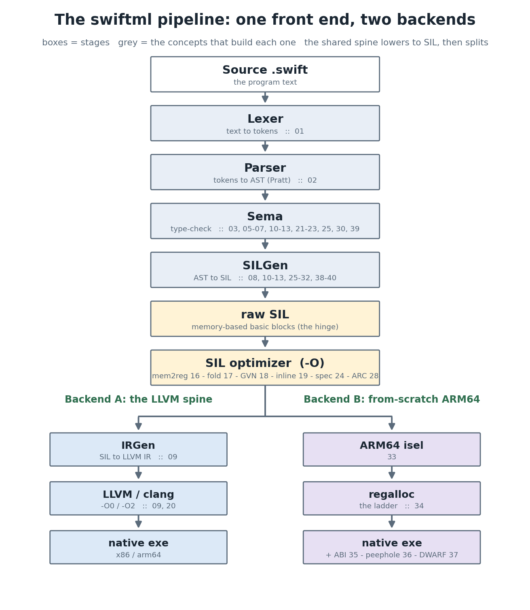
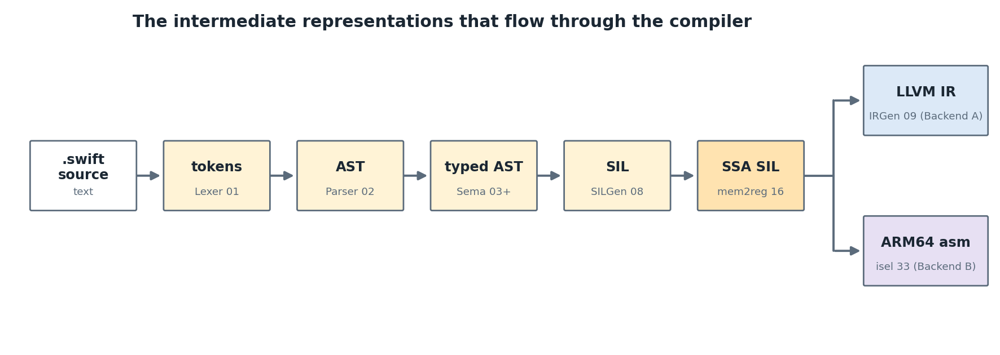
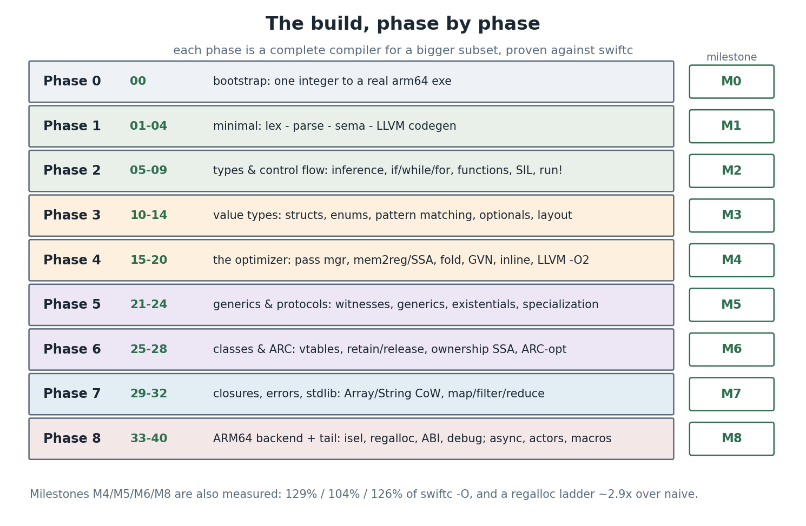

<!--
The whole-course map: what every concept builds, where it sits in the compiler pipeline, and where
to find it. Read this first to see the forest; read each concept's own explainer.qmd for the trees.
Figures are real, from figs/make_figs.py.
-->

## 1. What this is

**swiftml** is a working compiler for a growing subset of Swift, built **from scratch in OCaml**,
one concept at a time, with the **same architecture as Apple's real compiler**. It is a course: 41
self-contained concepts (`00`–`40`) grouped into 9 phases. Each concept is a small lesson — a deep
explainer, a code skeleton you fill in, a frozen reference solution, and a test suite — and each
*phase* is a **complete compiler** for a bigger slice of the language than the one before.

Two ideas hold the whole thing together:

- **Two oracles keep us honest.** `swift/` is Apple's real compiler *source* — the **design oracle**
  we mirror (its `lib/Parse`, `lib/SILGen`, `lib/SIL`, …). `/usr/bin/swiftc` is the installed
  toolchain — the **behavioral oracle**: we compile the same `.swift` with swiftml and with swiftc
  and assert **identical stdout and exit code**, at `-Onone` and `-O`. A concept isn't "done" until
  it matches.
- **Two backends from one front end.** Every program is lexed, parsed, type-checked, and lowered to
  **SIL** (Swift Intermediate Language). From there it can go down the **LLVM spine** (faithful to
  swiftc) *or* through a **from-scratch ARM64 backend** we build by hand in Phase 8.



The rest of this document walks the pipeline top to bottom, then walks the course phase by phase,
and ends with a full index mapping every concept to its place in the machine and its folder on disk.

## 2. The pipeline, stage by stage

A compiler is a sequence of **lowerings**: each stage takes one representation of the program and
produces a lower-level one, until we reach machine code. swiftml's stages, and the concepts that
build them:

| Stage | Job | Produces | Built in |
|---|---|---|---|
| **Lexer** | source text → words | a token stream | `phase1-minimal/01-lexer` |
| **Parser** | tokens → tree (recursive descent + Pratt) | the **AST** | `phase1-minimal/02-parser` |
| **Sema** | name resolution + type checking | a **typed AST** + diagnostics | `phase1-minimal/03-sema`, then every concept that adds a type rule (`05`–`07`, `10`–`13`, `21`–`23`, `25`, `30`, `39`) |
| **SILGen** | typed AST → SIL (control flow becomes basic blocks) | **raw SIL** | `phase2-types-flow/08-sil-silgen`, extended by `10`–`13`, `25`–`32`, `38`–`40` |
| **SIL optimizer** | machine-independent `-O` passes over SIL | **optimized SIL** | all of `phase4-optimizer/15`–`20`, plus `24` (specialization) and `28` (ARC-opt) |
| **IRGen** *(Backend A)* | SIL → LLVM IR (near 1:1, both are memory + blocks) | **LLVM IR** | `phase2-types-flow/09-sil-to-llvm` |
| **LLVM / clang** *(Backend A)* | LLVM's optimizer + codegen | a **native executable** | `09` (`-O0`), `phase4-optimizer/20-llvm-opt` (`-O2`) |
| **ARM64 isel** *(Backend B)* | SIL → ARM64 instructions | assembly over virtual registers | `phase8-arm64-backend/33-arm64-isel` |
| **regalloc** *(Backend B)* | virtual → physical registers (a runnable ladder) | real ARM64 asm | `phase8-arm64-backend/34-register-allocation` |
| **+ ABI / peephole / debug** | AAPCS64 frames, redundancy removal, DWARF lines | a native, debuggable exe | `35-mc-abi`, `36-peephole-sched`, `37-debug-info` |

**SIL is the hinge.** Everything above it is shared; everything below it is a backend. That is
exactly why we spend a whole phase (Phase 4) optimizing *SIL* — improvements there help **both**
backends. The reason SIL is *memory-based* (values live in `alloc_stack` slots, not SSA registers)
is pedagogical: it lets us **learn SSA properly** later, by *building* `mem2reg` ourselves in
`phase4-optimizer/16-mem2reg-ssa` and watching a loop turn into block-argument (φ) form.



### The control-flow idea that recurs everywhere

The same shape — a **`cond_br` diamond** that branches, does work on each side, and **merges** —
shows up at every level: an `if`/`else` in SILGen, a short-circuit `&&`/`||` or a ternary `a ? b : c`
lowered as a value-producing diamond, an optional `??`, a `switch` dispatch, and the φ-nodes
`mem2reg` introduces at a merge. Learn it once in `08-sil-silgen` and you see it for the rest of the
course.

## 3. The build, phase by phase

Each phase takes the compiler from the previous phase and grows it — the library graph mirrors the
pipeline (`swiftml_lexer ← swiftml_parser ← swiftml_sema ← …`), and each phase links a `swiftml`
binary (`swiftml`, `swiftml2`, … `swiftml9`) for its subset.



- **Phase 0 — bootstrap** (`phase0-bootstrap/00-setup`). The self-contained `swiftml-m0` compiles a
  *single integer* to a real arm64 executable. Proves the toolchain end-to-end. **→ M0.**
- **Phase 1 — minimal compiler** (`phase1-minimal/01`–`04`). Hand-written lexer and parser, a
  scope-walking type checker, and LLVM codegen for integers, variables, and arithmetic. The first
  programs that *run*. **→ M1.**
- **Phase 2 — types & control flow** (`phase2-types-flow/05`–`09`). Bidirectional type inference,
  `if`/`while`/`for`, functions (two-pass, so recursion + forward refs work), then **SIL + SILGen**
  (`08`) and **IRGen** (`09`) — the first programs that match swiftc byte-for-byte. **→ M2.**
- **Phase 3 — value types** (`phase3-value-types/10`–`14`). `struct` (value semantics), `enum`
  (tagged unions), `switch` pattern matching, `Optional` (sugar over the enum engine, with real
  force-unwrap traps), and memory layout (size/stride/alignment). **→ M3.**
- **Phase 4 — the optimizer** (`phase4-optimizer/15`–`20`). A pass manager, then the classic SSA
  construction (`mem2reg`, `16`), constant folding/DCE (`17`), GVN/CSE (`18`), inlining (`19`), and
  finally handing optimized SIL to LLVM `-O2` (`20`). **→ M4: ~129% of swiftc -O.**
- **Phase 5 — generics & protocols** (`phase5-generics/21`–`24`). Protocol witnesses, generic
  functions (type erasure + inference), existential boxing + dynamic casts, and the two
  abstraction-erasing passes — devirtualization and **specialization**. **→ M5: ~104%.**
- **Phase 6 — classes & ARC** (`phase6-classes-arc/25`–`28`). Classes + vtables + inheritance, the
  ARC runtime (retain/release, deinit timing parity), **ownership SSA** + a verifier, and ARC
  optimization (copy-propagation). **→ M6: ~126%.**
- **Phase 7 — closures, errors, stdlib** (`phase7-closures-stdlib/29`–`32`). First-class closures
  (the thick `{code, ctx}` pair), `throws`/`try`/`do`-`catch`/`defer` (pure desugaring), and the
  first stdlib types — `Array`/`String` with **copy-on-write** — plus `map`/`filter`/`reduce`.
  **→ M7.**
- **Phase 8 — the native backend & the tail** (`phase8-arm64-backend/33`–`40`). The from-scratch
  ARM64 backend (isel `33`, the regalloc **ladder** `34`, AAPCS64 `35`, peephole `36`, DWARF debug
  info `37`), then the language tail on the LLVM path: `async`/`await` (`38`), `actor`s (`39`), and a
  compile-time **macro** expander (`40`). **→ M8.**

## 4. The two backends, side by side

Both consume the *same* optimized SIL; they differ in everything below it.

- **Backend A — the LLVM spine** (`09`, `20`). SIL → LLVM IR is nearly mechanical because both are
  memory-based with explicit basic blocks. We then lean on LLVM (`clang -O0`/`-O2`) for register
  allocation, instruction selection, and scheduling. This is the path that mirrors swiftc and that
  we benchmark against `swiftc -O`.
- **Backend B — from-scratch ARM64** (`33`–`37`). No LLVM: we select ARM64 instructions ourselves
  (`33`), allocate registers with a runnable **ladder** — stack → linear-scan → graph-colouring
  (`34`, ~2.9× over naive) — conform to the Apple **AAPCS64** ABI (`35`), clean up with a peephole
  pass (`36`), and emit a **DWARF line table** so `lldb` can step the result (`37`). The same corpus
  is differential-tested against Backend A *and* swiftc.

## 5. Full concept index

Every concept is a folder `phaseN-<name>/NN-<concept>/`. The pipeline stage tells you *where it
lives in the machine*; the path tells you *where it lives on disk*.

| # | Concept (folder) | Pipeline stage | What you build |
|---|---|---|---|
| 00 | `phase0-bootstrap/00-setup` | whole pipeline (toy) | one integer → arm64 exe |
| 01 | `phase1-minimal/01-lexer` | Lexer | tokens + spans |
| 02 | `phase1-minimal/02-parser` | Parser | the AST (Pratt precedence) |
| 03 | `phase1-minimal/03-sema` | Sema | scope walk + diagnostics |
| 04 | `phase1-minimal/04-codegen` | IRGen/LLVM | first native runs |
| 05 | `phase2-types-flow/05-types-inference` | Sema | bidirectional inference |
| 06 | `phase2-types-flow/06-control-flow` | Sema | `if`/`while`/`for`, `&&`/`||` |
| 07 | `phase2-types-flow/07-functions` | Sema | two-pass, missing-return |
| 08 | `phase2-types-flow/08-sil-silgen` | **SILGen** | SIL + the CFG diamond |
| 09 | `phase2-types-flow/09-sil-to-llvm` | **IRGen** | SIL → LLVM IR → run |
| 10 | `phase3-value-types/10-structs` | SILGen | value semantics |
| 11 | `phase3-value-types/11-enums-adts` | SILGen | tagged unions |
| 12 | `phase3-value-types/12-pattern-matching` | SILGen | `switch` dispatch |
| 13 | `phase3-value-types/13-optionals` | SILGen | optionals + traps |
| 14 | `phase3-value-types/14-memory-layout` | (analysis) | size/stride/align |
| 15 | `phase4-optimizer/15-pass-manager` | SIL opt | the pass manager |
| 16 | `phase4-optimizer/16-mem2reg-ssa` | SIL opt | **SSA construction** |
| 17 | `phase4-optimizer/17-constfold-dce` | SIL opt | fold + DCE |
| 18 | `phase4-optimizer/18-cse-gvn` | SIL opt | global value numbering |
| 19 | `phase4-optimizer/19-inlining` | SIL opt | inlining (the cascade) |
| 20 | `phase4-optimizer/20-llvm-opt` | LLVM | clang `-O2`, measured |
| 21 | `phase5-generics/21-protocols-witness` | Sema+SILGen | witness tables |
| 22 | `phase5-generics/22-generics` | Sema+SILGen | erasure + inference |
| 23 | `phase5-generics/23-existentials` | SILGen | boxing + dynamic casts |
| 24 | `phase5-generics/24-specialization` | SIL opt | devirt + specialization |
| 25 | `phase6-classes-arc/25-classes-vtables` | Sema+SILGen | classes + vtables |
| 26 | `phase6-classes-arc/26-arc-runtime` | SILGen | retain/release/deinit |
| 27 | `phase6-classes-arc/27-ownership` | SIL | ownership SSA + verifier |
| 28 | `phase6-classes-arc/28-arc-optimization` | SIL opt | copy-propagation |
| 29 | `phase7-closures-stdlib/29-closures` | SILGen | the thick-fn ABI |
| 30 | `phase7-closures-stdlib/30-error-handling` | SILGen | `throws` desugaring |
| 31 | `phase7-closures-stdlib/31-stdlib-array-string` | SILGen+rt | Array/String CoW |
| 32 | `phase7-closures-stdlib/32-stdlib-collections` | SILGen | map/filter/reduce |
| 33 | `phase8-arm64-backend/33-arm64-isel` | **isel (B)** | SIL → ARM64 asm |
| 34 | `phase8-arm64-backend/34-register-allocation` | **regalloc (B)** | the ladder |
| 35 | `phase8-arm64-backend/35-mc-abi` | ABI (B) | AAPCS64 frames/calls |
| 36 | `phase8-arm64-backend/36-peephole-sched` | peephole (B) | redundancy removal |
| 37 | `phase8-arm64-backend/37-debug-info` | debug (B) | DWARF line table |
| 38 | `phase8-arm64-backend/38-async-await` | SILGen | coroutines + executor |
| 39 | `phase8-arm64-backend/39-actors` | Sema | isolation rule |
| 40 | `phase8-arm64-backend/40-macros` | (pre-Sema) | AST→AST expander |

## 6. How a concept is built (and how to run it)

Every concept folder has the same shape (template in `_TEMPLATE-concept/`):

```
NN-concept/
├── README.md       # objective, the version ladder, definition of done
├── explainer.qmd   # THE LESSON — a full from-zero tutorial (9 sections)
├── <stage>.ml      # THE SOURCE YOU EDIT — ships as a skeleton with TODO holes
├── solution/       # the frozen, verified answer key
├── tests/          # cram (FileCheck-style) + alcotest unit tests = the spec
├── figs/           # real diagrams (matplotlib/graphviz), generated, never stubbed
└── bench/          # for perf-relevant concepts
```

The source you edit lives **in the concept dir**, and each concept is a small library that depends
on the previous one — so the compiler is assembled stage by stage. Skeletons **carry the previous
work forward** and leave a `TODO(NN)` hole only for the *new* idea; you write the new logic, never
re-type the old. Tests are **RED on the shipped skeleton, GREEN once `solution/` is in place** — a
discipline that proves the tests actually test something.

### Launching the compiler

Each phase links its own `swiftml` binary, built from that phase's concept libraries — so the binary
*is* the compiler for that phase's subset. The newest, **`swiftml9`**, is the most complete (the
full-language LLVM path); **`swiftml8`** is the from-scratch ARM64 backend.

| binary | phase — subset it compiles | backend |
|---|---|---|
| `swiftml`  | 1 — ints, vars, arithmetic | LLVM |
| `swiftml2` | 2 — + control flow, functions | LLVM |
| `swiftml3` | 3 — + structs, enums, optionals | LLVM |
| `swiftml4` | 4 — + the optimizer (`-O`) | LLVM |
| `swiftml5` | 5 — + generics & protocols | LLVM |
| `swiftml6` | 6 — + classes & ARC | LLVM |
| `swiftml7` | 7 — + closures, errors, Array/String | LLVM |
| `swiftml8` | scalar subset, **native ARM64 asm** | ARM64 |
| `swiftml9` | full language (async, actors, macros) | LLVM |

Compile a `.swift` file to a native executable and run it (from `course/`):

```sh
echo 'print(6 * 7)' > demo.swift

dune exec swiftml9 -- build demo.swift -o demo      # compile (-Onone)
./demo                                              # => 42
dune exec swiftml9 -- build -O demo.swift -o demo   # optimized build

# inspect any IR along the way — each flag stops at one stage of the pipeline:
dune exec swiftml9 -- --emit-tokens demo.swift      # the token stream      (Lexer)
dune exec swiftml9 -- --emit-ast    demo.swift      # the AST               (Parser)
dune exec swiftml9 -- --typecheck   demo.swift      # front end only        (Sema)
dune exec swiftml9 -- --emit-sil    demo.swift      # raw SIL               (SILGen)
dune exec swiftml9 -- --sil-opt     demo.swift      # optimized SIL         (-O passes)
dune exec swiftml9 -- --emit-llvm   demo.swift      # LLVM IR               (IRGen)

# Backend B — the from-scratch ARM64 path:
dune exec swiftml8 -- --emit-asm     demo.swift     # ARM64 assembly        (isel)
dune exec swiftml8 -- build --native demo.swift -o demo && ./demo
```

(The shipped tree is **RED by design**: a phase binary is fully functional once that phase's concept
`solution/` files are in place. `bash comparisons/run.sh` performs that swap for you, then drives
`swiftml9` over the whole program suite.)

### Course tooling

```sh
make build                                            # build every phase binary
make lab C=phase4-optimizer/16-mem2reg-ssa            # one concept's tests (RED→GREEN)
make oracle F=tests/programs/arith.swift B=swiftml4   # diff a program vs swiftc
make explainer-pdf C=phase2-types-flow/08-sil-silgen  # render a lesson
bash comparisons/run.sh                               # 31 whole programs vs swiftc, -Onone & -O
```

## 7. Milestones, measured

Each milestone is verified against real swiftc (identical stdout + exit). The performance ones are
*measured*, best-of-3, against `swiftc -O`, and reported honestly (our subset uses wrapping
arithmetic and skips some checks, which flatters the comparison — see each phase's explainer §2):

| Milestone | Phase | What it proves | Result |
|---|---|---|---|
| M0–M3 | 0–3 | correctness parity on a growing language subset | byte-for-byte |
| **M4** | 4 | swiftml `-O` ≈ swiftc `-O` | **129%** geomean |
| **M5** | 5 | generics/protocols specialize away | **104%** |
| **M6** | 6 | ARC + ownership, deinit timing parity | **126%** |
| M7 | 7 | closures, errors, CoW stdlib | byte-for-byte |
| **M8** | 8 | the from-scratch ARM64 backend | regalloc ~2.9× over naive |

## 8. How we know it works

Beyond the per-concept tests, `comparisons/` holds **31 classical whole programs** — sorts, n-queens,
a Sudoku backtracking solver, a bytecode VM, Dijkstra, bignum factorial, Game of Life, a
recursive-descent expression parser, Kruskal's MST, protocols+generics+class hierarchies, ternary
stress, and more — each compiled by **both** swiftml and swiftc at `-Onone` and `-O` and checked for
identical output. Writing whole programs (a far stronger oracle than the hand-picked per-concept
corpora) is what surfaced — and let us fix — real bugs like non-short-circuiting `&&`, throwing
methods that didn't propagate, and array-returning functions. The critical review and the open
follow-ups are catalogued in `../PROOFREAD.md`.

**The shape of the whole thing:** one hand-written front end; one SIL that everything lowers to and
that the optimizer improves; two backends that turn it into native code; and, at every step, real
swiftc as the judge. Read on into any `phaseN-…/NN-…/explainer.qmd` — you now know exactly where it
sits in the machine.
