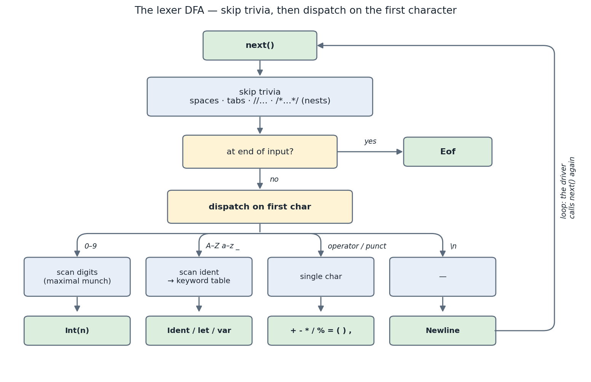

## 1. What you'll build, and why

You'll hand-write the **lexer** (a.k.a. scanner): the function that reads raw Swift source text and
produces a flat list of **tokens** — `print`, `(`, `1`, `+`, `2`, `)`, newline, eof. Everything
downstream (parser, type checker, codegen) works on tokens, never on characters.

- **You implement:** `lexer.ml : next` (in this concept dir) — return the next token from the cursor.
- **Outcome:** `swiftml --emit-tokens arith.swift` prints the correct token stream; the parser in
  concept 02 consumes it.
- **Out of scope (Phase 1):** string/float literals, interpolation, most keywords/operators,
  Unicode identifiers — added in later phases.

We hand-write it (rather than use `ocamllex`) for two reasons: it's how the **real Swift compiler**
does it (`swift/lib/Parse/Lexer.cpp` is a hand-written DFA), and it gives us full control over
source positions, error recovery, and Swift's quirks (significant newlines, nesting comments).

### The Phase-1 Swift subset (the whole picture)

Phase 1 is a *complete* compiler for a deliberately tiny slice of Swift — just enough to print
integer arithmetic. The entire phase (lexer → parser → sema → codegen) targets exactly this subset:

- **Integer arithmetic** — `Int` literals (decimal), the binary operators `+ - * / %` with C-like
  precedence and associativity, parentheses, and unary `-`.
- **Bindings** — `let` (constant) and `var` (mutable), plus reassignment of a `var` via `=`.
- **Output** — `print(_:)`. In Swift `print` is *just an identifier*; `print(x)` is an ordinary call.
- **Program structure** — a sequence of top-level statements, one per line. **Newlines terminate
  statements** (no semicolons).
- **Trivia** — spaces/tabs, `//` line comments, and `/* … */` block comments (which *nest*).

Everything else is out of scope until later phases: `String`/`Double`/`Bool`, `if`/`while`/`for`,
`func`, structs/enums, generics, Unicode identifiers, string/float literals, interpolation, …

> **Swift notes** — you know systems languages but not Swift yet, so here's what's non-obvious about
> this subset. (The lexer only *tokenizes*; the semantics below land in `03-sema`/`04-codegen`, but
> they're worth knowing now because matching them is what "parity with `swiftc`" means.)
>
> - **`let` vs `var` are bindings, not `const`.** Think Rust's `let` / `let mut`: `let` is an
>   immutable binding checked at compile time, `var` is reassignable. The lexer just recognizes them
>   as keywords; the "can't reassign a `let`" rule is enforced later in sema.
> - **`Int` is the default integer** — 64-bit signed, pointer-width (like Rust's `isize`). A bare
>   literal like `8` is an `Int`. The lexer emits `Int(8)`; it never evaluates anything.
> - **Arithmetic traps on overflow.** Unlike C's silent wraparound, Swift's `+ - *` *trap* (crash
>   with a runtime diagnostic) on `Int` overflow in `-Onone`; the wrapping forms are the explicit
>   `&+ &- &*` (not in our subset yet). Reproducing this trap is a `04-codegen` parity gotcha.
> - **`/` and `%` are integer ops that also trap.** `1 / 0` and `x % 0` trap; `%`'s result takes the
>   sign of the dividend (C99-style, *unlike* Python's floored `%`). Lexer emits `/` `%`; the
>   trap-and-sign behavior is codegen's job.
> - **Newlines are significant.** Swift ends statements at line breaks (like Python/Go, unlike
>   C/Java's `;`). That's *why* the lexer emits a real `Newline` token instead of discarding `\n`:
>   the parser needs it to find statement boundaries.

Here is a program that exercises essentially everything Phase 1 supports — your lexer must turn it
into a clean token stream (we'll trace it in §2):

```swift
// area of a rectangle
let width  = 8
var height = 5
print(width * height - 3)   /* prints 37 */
```

## 2. Concepts in depth

### The grammar: what the lexer recognizes, and where the tokens go

Two grammars orient the whole phase. The first is the one **you implement here** — the *lexical*
grammar, i.e. the set of tokens. The second (the *syntactic* grammar) is what concept **02-parser**
builds from those tokens; the lexer doesn't enforce it, but seeing it tells you what each token is
*for*. Notation: `::=` defines a rule, `|` is choice, `*` zero-or-more, `?` optional, `()` groups,
`"x"` is literal text.

**Lexical grammar — the lexer's contract (this concept).** Each rule below produces one
`Token.kind` (see `token.ml`); trivia is consumed but never emitted.

```
token         ::= Int | Ident | keyword | operator | punct | Newline    # then finally Eof

Int           ::= digit+                          # decimal only in Phase 1  -> Token.Int
Ident         ::= id-head id-tail*                # -> Token.Ident (unless a keyword, below)
keyword       ::= "let" | "var"                   # an Ident whose spelling is in the keyword table
operator      ::= "+" | "-" | "*" | "/" | "%" | "="
punct         ::= "(" | ")" | ","
Newline       ::= "\n"                            # SIGNIFICANT: terminates a statement

id-head       ::= "A"…"Z" | "a"…"z" | "_"
id-tail       ::= id-head | digit
digit         ::= "0"…"9"

# Trivia — consumed by the lexer, NOT emitted as tokens:
whitespace    ::= " " | "\t"
line-comment  ::= "//" (any-char-except-newline)*
block-comment ::= "/*" ( block-comment | any-char )* "*/"    # note: nests, unlike C
```

That's the complete set: the `,` (`Token.Comma`) is Swift's general argument separator — it's
tokenized for forward-compatibility even though the Phase-1 corpus only ever calls single-argument
`print`. `=` is `Token.Eq`; there is no `==` yet.

**Syntactic grammar — the Phase-1 subset (orientation; built in 02-parser).** This is where the
tokens are headed. The lexer is blind to it — it never decides whether a `-` is unary or binary, or
whether a `var` may be reassigned; that's the parser's and sema's job. It's here so the token set
makes sense.

```
program    ::= ( Newline | statement Newline )* Eof    # blank/comment-only lines are bare Newlines
statement  ::= "let" Ident "=" expr            # constant binding
             | "var" Ident "=" expr            # mutable binding
             | Ident "=" expr                  # reassignment (var only — checked in sema)
             | expr                            # an expression statement, e.g. print(...)

expr       ::= add
add        ::= mul ( ("+" | "-") mul )*        # lowest precedence, left-assoc
mul        ::= unary ( ("*" | "/" | "%") unary )*
unary      ::= "-" unary | primary             # unary minus
primary    ::= Int
             | Ident
             | Ident "(" args? ")"             # call — Phase 1 only ever calls print
             | "(" expr ")"
args       ::= expr ( "," expr )*
```

**Tracing the example.** Run `swiftml --emit-tokens` on the §1 program and you get the stream below.
Watch three things: the comment-only first line still yields a `newline`; multi-digit `8` is one
`int(8)` (maximal munch); and the trailing `/* prints 37 */` is dropped, but its line's `\n` is not.

```
newline          # line 1 was only `// area of a rectangle` — the comment is skipped, the line break is a token
let              # `let` matched the keyword table, so Kw_let, not ident(let)
ident(width)
=
int(8)
newline
var
ident(height)
=
int(5)
newline
ident(print)     # `print` is a plain identifier
(
ident(width)
*
ident(height)
-                # the lexer emits `-`; whether it's unary/binary is the parser's call
int(3)
)
newline
eof
```

### A lexer is a state machine over a character cursor

The lexer holds a cursor into the source string and, on each call to `next`, classifies the
upcoming characters into exactly one token. The shape is always the same:

```
skip whitespace/comments  ->  look at the first significant char  ->  dispatch:
   digit         => scan an integer literal
   letter / '_'  => scan an identifier, then check if it's a keyword
   operator char => emit that operator token
   '\n'          => emit a Newline token   (significant in Swift!)
   end of input  => emit Eof
```

Each branch consumes characters with `bump` (which also advances line/column) and builds a token
spanning `[start, here)` so later stages can point diagnostics at exact source ranges.

### Maximal munch

When several tokens could start here, take the **longest** one. `123` is one `Int(123)`, not three
digit tokens; `print` is one identifier, not five. You implement this by *looping while the next
char still belongs to the current token* (all digits; all identifier chars).

### Three Swift-specific subtleties (read the oracle)

1. **Newlines are tokens.** Swift uses line breaks to terminate statements (no semicolons needed),
   so we emit `Token.Newline` rather than silently skipping `\n`. Other whitespace (spaces, tabs)
   *is* skipped.
2. **Block comments nest.** `/* a /* b */ c */` is one comment. Track a depth counter, unlike C.
   The sharpest consequence: **`/*/*/` is *unterminated* in Swift** — two openers, one closer —
   while C reads the very same five characters as one finished comment. (Check it:
   `swiftc -typecheck` rejects it with `unterminated '/*' comment`, and accepts `/*/**/*/`.)
   Getting this right is what the depth counter buys you; the test suite has the full battery.
3. **Keywords are identifiers that match a table.** Scan the identifier, then call
   `Token.keyword_or_ident` — exactly how `swift/lib/Parse/Lexer.cpp` separates `kw_let` from a
   plain identifier.

> Compare with the oracle: open `../../swift/lib/Parse/Lexer.cpp` and find `Lexer::lexImpl` — it's
> a big `switch` on the current character, with `lexNumber`, `lexIdentifier`, `skipToEndOfLine`,
> and nesting `/* */` handling. Ours is the same shape, much smaller.



*(regenerate: `make figs C=phase1-minimal/01-lexer`)*

### The third file: `diagnostics.ml`

This directory holds three sources, all one library (`swiftml_lexer`): `token.ml` (the contract —
the alphabet), `lexer.ml` (the one you edit), and `diagnostics.ml` — **the compiler's error sink**,
fully written, mirroring `swift/lib/AST/DiagnosticEngine.cpp`:

```ocaml
type severity = Error | Warning | Note
type t    = { severity : severity; span : Token.span; message : string }
type sink = { mutable diags : t list }          (* threaded through the front end *)

val create     : unit -> sink
val error      : sink -> Token.span -> string -> unit
val warning    : sink -> Token.span -> string -> unit
val has_errors : sink -> bool
val print      : sink -> unit                   (* swiftc-style `line:col: error: message` *)
```

The pattern is *collect, then report*: a stage pushes diagnostics into the sink and keeps going, so
one run surfaces every error rather than dying on the first; the driver then calls `has_errors`,
prints, and exits 1 (`Driver.bail_on_errors`). This is why every diagnostic carries a `Token.span` —
the spans you build in this concept are what make `line:col` possible three stages later.

**The lexer takes one too**, which is why `create` has two parameters:

```ocaml
Lexer.create  : string -> Diagnostics.sink -> t           (* here *)
Parser.create : Token.t list -> Diagnostics.sink -> t     (* concept 02 *)
Sema.check    : Ast.program  -> Diagnostics.sink -> unit  (* concept 03 *)
```

That mirrors the oracle exactly: swiftc's `Lexer` constructor takes a `DiagnosticEngine *`
(`swift/include/swift/Parse/Lexer.h:150`), `Lexer::diagnose` is called **59 times** inside
`Lexer.cpp`, and `DiagnosticsParse.def` defines **35** `lex_*` diagnostics. Two of them are ours:

| ours | swiftc |
|---|---|
| `"invalid character in source file"` | `diag::lex_invalid_character` |
| `"unterminated '/*' comment"` | `diag::lex_unterminated_block_comment` |

One detail matters more than the wording: **the lexer recovers**. On a byte outside the alphabet it
reports, drops the byte, and lexes on, so a file with three bad characters yields three diagnostics
and a complete token stream. A lexer that raises on the first problem can only ever tell you about
one, and it cannot hand the parser anything at all. (swiftc goes one step further and makes the
engine *optional* — `Lexer::diagnose` no-ops when the pointer is null, for callers that lex purely
to colour syntax. Our sink is always present; it is simply empty when nothing goes wrong.)

The helper is given, right under `make`:

```ocaml
let error (lx : t) (lo : Token.pos) (msg : string) : unit =
  Diagnostics.error lx.diags { Token.lo; hi = here lx } msg
```

## 3. Build it, step by step

Open `lexer.ml` in this directory. The cursor type, `create`, and the helpers `here`, `at_end`, `peek_char`,
`bump`, `make`, plus the `tokenize` driver are **already written**. You implement **`next`**.

1. **Skip trivia.** Loop: while `peek_char lx` is a space or tab, `bump`. Then handle comments:
   if you see `//`, `bump` to end of line (but *don't* consume the `\n` — it's a token). If you see
   `/*`, consume a **nesting** block comment (track depth). After skipping, you may need to loop
   again (comment followed by spaces).
2. **Capture the start** with `let lo = here lx in`.
3. **End of input:** `if at_end lx then make lo lx Token.Eof`.
4. **Dispatch** on `peek_char lx`:
   - `'0'..'9'`: scan digits into a substring, `int_of_string` it, `make lo lx (Token.Int n)`.
     ```ocaml
     let start = lx.pos in
     while (not (at_end lx)) && (let c = peek_char lx in c >= '0' && c <= '9') do ignore (bump lx) done;
     let n = int_of_string (String.sub lx.src start (lx.pos - start)) in
     make lo lx (Token.Int n)
     ```
   - letter or `'_'`: scan an identifier the same way (first char letter/`_`, rest
     letters/digits/`_`), then `make lo lx (Token.keyword_or_ident text)`.
   - `'+'` → `Plus`, `'-'` → `Minus`, `'*'` → `Star`, `'/'` → `Slash` (only if not a comment, which
     you already handled), `'%'` → `Percent`, `'='` → `Eq`, `'('` → `LParen`, `')'` → `RParen`,
     `','` → `Comma`. Each: `ignore (bump lx); make lo lx <kind>`.
   - `'\n'`: `ignore (bump lx); make lo lx Token.Newline`.
   - anything else: `error lx lo "invalid character in source file"`, then **consume the byte and
     carry on** (`ignore (bump lx); next lx`) — reporting without recovering would still stop at the
     first bad character. Same for an unterminated `/* …`: report at end of input, return `Eof`.

**Tip:** factor the "scan while predicate" into a local helper:
```ocaml
let take_while lx pred =
  let start = lx.pos in
  while (not (at_end lx)) && pred (peek_char lx) do ignore (bump lx) done;
  String.sub lx.src start (lx.pos - start)
```

Don't peek at §8 until you've tried it.

## 4. Test it

```bash
make lab C=phase1-minimal/01-lexer
```

Two suites run: the cram test diffs the printed token stream from `swiftml --emit-tokens`, and
`tests/test_lexer.ml` (alcotest) asserts kinds **and spans** in-process. Between them they pin the
corners that are easy to get subtly wrong:

- **every comment shape** — `/**/`, `/*/ */`, `/* a **/`, the nested `/*/**/*/`, three-deep nesting,
  `//` inside a block, `/*` inside a line comment, back-to-back comments, a comment as the whole file;
- **unterminated block comments are errors** (`/*`, `/*/`, `/*/*/`, `/* /* */`, `1 + /* x`) — matching
  `swiftc`, which rejects each one with `unterminated '/*' comment`;
- **spans start at the token, not at the trivia in front of it** — the newline after `// c` must
  begin at the newline, not at the `//`. A kinds-only test can never catch that, and everything
  downstream (parser diagnostics, and DWARF line numbers in Phase 8) points at these spans;
- **CRLF files** lex like LF ones (`'\r'` is trivia);
- end-of-file edges: no trailing newline, comment-at-eof, empty input.

Because the exact stream is deterministic from `token.ml`, you can record/refresh the cram
golden output with `dune promote` once your `next` is correct. Expected for `print(1 + 2)`:

```
ident(print)
(
int(1)
+
int(2)
)
newline
eof
```

## 5. Benchmark it

```bash
make bench C=phase1-minimal/01-lexer      # lexer throughput in MB/s, v0 vs v1
```

`bench/bench.ml` generates ~3 MB of representative Swift source and lexes it 20×, reporting MB/s for
two rungs. The bench **first asserts the fast rung produces the identical token stream** (kinds *and*
line/col spans) — a faster lexer that changes the output is a bug, not a win — then times both:

```
  equivalence: v1_fast == v0_naive  (kinds + line/col spans) OK
  v0_naive      42.5 MB/s   (750001 tokens/lex)
  v1_fast      353.0 MB/s   (750001 tokens/lex)
  => v1_fast is 8.3x v0_naive
```

So we go from ~42 MB/s to **~350 MB/s — squarely in swiftc's "hundreds of MB/s" band**. Here's the
whole story, because *how* you get there is the lesson.

### Finding the bottleneck: `make profile`

A throughput number tells you *that* it's slow, never *where*. Two extra reports do that:

```bash
make profile     C=phase1-minimal/01-lexer   # what costs what, and what allocates
make profile-cpu C=phase1-minimal/01-lexer   # sampled call tree (macOS `sample`)
```

`bench/profile.ml` prints four views, each attacking the question from a different side.

**1 — cost per construct.** The same 2 MB, nine times, each dominated by one token shape. Compare
`ns/token` across shapes (MB/s also reflects how many tokens a shape packs per byte, so it flatters
comments, which produce none):

```
   construct             MB/s v0    MB/s v1  ns/token v0     tokens
   identifiers              74.9      323.1        120.1     222224
   integers                 78.5      393.6        101.9     250001
   operators                26.3       92.9         76.0    1000009
   line comments           181.9      513.1         99.0     111113
   block comments          116.3      478.1           -           1
```

Comments are the *cheapest* bytes in the file — they never build anything. Identifiers are the
dearest tokens: they call `String.sub`, and `Token.keyword_or_ident` compares the result.

**2 — the cost ladder.** The same input at three levels of ambition, which separates *scanning*
from *building*:

```
   byte scan floor (no tokens)          1025.6 MB/s      1.95 ms   memory bandwidth ceiling
   v1_fast (offsets, columnar)           233.6 MB/s      8.56 ms   612256 tokens
   v0 (Token.t list + line/col)           40.3 MB/s     49.68 ms   612256 tokens

   => scanning itself is 4% of v0's time; the other 96% is what v0 BUILDS
```

That single line is the whole diagnosis. Touching every byte costs 2 ms; the lexer costs 50 ms.
**Optimising the scan loop cannot win more than 4%.**

**3 — allocation accounting.** `Gc.quick_stat` deltas around one pass: words allocated, words per
token, minor and major collections. This is where "allocation-bound" stops being a claim and
becomes a number (~25 words/token for the reference v0, ~7 for v1_fast).

**4 — allocation sites.** `Gc.Memprof` samples one allocation in a thousand *with a callstack*, and
the report attributes the sampled words to the innermost frame that has a source location:

```
   lexer.ml:22 here                        22.0%  ########
   lexer.ml:37 make                        19.3%  #######
```

That is as close as it gets to "this line is the bottleneck" — `here` builds a `Token.pos`, `make`
builds the token and its span, and `take_while` is a closure allocated per call.

Once the fast rung exists, the same section runs for **it** too, and the contrast is the lesson:

```
4. ALLOCATION SITES (v1_fast)
   lexer_v1_fast.ml:113 Lexer_v1_fast.lex.push.grow   66.9%
   lexer_v1_fast.ml:105 Lexer_v1_fast.lex             11.5%   (Array.make tags)
   lexer_v1_fast.ml:107 Lexer_v1_fast.lex             11.5%   (Array.make ends)
   lexer_v1_fast.ml:106 Lexer_v1_fast.lex             10.1%   (Array.make starts)
```

Four sites, all of them *arrays* — the initial three and their doublings. Nothing is attributed to a
token, because the scan never builds one. "Allocates essentially nothing per token" stops being a
claim and becomes a list you can read.

And then the honest third view, `v1_fast + to_tokens`, which materialises the same `Token.t list`
v0 produces:

```
   lexer_v1_fast.ml:84  Lexer_v1_fast.pos_of           29.1%
   lexer_v1_fast.ml:113 lex.push.grow                  17.7%
   lexer_v1_fast.ml:262 to_tokens.build                11.1%
   lexer_v1_fast.ml:257 to_tokens.build                10.9%
   lexer_v1_fast.ml:259 to_tokens.build                10.9%
```

The records and the positions are back — `pos_of` is now the single biggest allocator. The fast rung
never made those costs disappear, it **deferred** them; demand every token's span and you pay again.
That is exactly why the parser is meant to consume the soup, asking for a position only when it has
a diagnostic to place — which is what swiftc does with `SourceLoc` and `SourceManager`.

**And the CPU view.** `make profile-cpu` runs a steady lexing workload (`profile.exe --spin`,
v0 only, no Memprof overhead) and attaches macOS `sample` to it, then flattens the call tree and
sorts by top-of-stack:

```
   frame                                       samples  share
   caml_shared_try_alloc                           780   18.6% [GC]
   do_some_marking                                 661   15.8% [GC]
   pool_sweep                                      612   14.6% [GC]
   oldify_one                                      566   13.5% [GC]
   oldify_mopup                                    295    7.0% [GC]
   Lexer.next                                      277    6.6%
   try_update_object_header                        271    6.5% [GC]
   Lexer.bump                                      153    3.7%
   List.rev_append                                  96    2.3%
   Lexer.take_while                                 76    1.8%
   ...

   (the table lists the top 15 of 27 frames = 96.7% of samples; the shares below
    are over ALL frames, so they do not add up from the rows above)

   OCaml code (yours + stdlib)   20.5%   14 frames
   GC / allocator                76.5%    7 frames
   other runtime                  3.0%    6 frames
```

Two things to read carefully here. The **table is a top-15 excerpt while the three shares cover
every frame**, so don't try to add the rows up — the report prints how many frames exist and what
fraction the visible ones account for, precisely so the two can't be confused. And the first bucket
is labelled **"yours + stdlib"** because the demangler cannot tell your code from the standard
library: both are ordinary OCaml frames. In the run above, `List.rev_append` (2.3%, from the
`List.rev` at the end of `tokenize`) and `List.length_aux` (1.2%, the harness counting tokens) are
stdlib, so *your* lexer is nearer 16% than 20%. Frames like `parse_intnat` — the C function behind
`int_of_string` — land in "other runtime" instead.

**Profiling the fast rung.** Once `lexer_v1_fast.ml` works, pass the rung — the tool spins one
scanner at a time, because the bench interleaves both and v0 (nine times slower) would swamp the
samples:

```bash
make profile-cpu C=phase1-minimal/01-lexer            # v0 (default)
make profile-cpu C=phase1-minimal/01-lexer RUNG=v1    # the fast rung
```

The report names the workload on its first line, and the two pictures could hardly differ more:

| | hottest frames | OCaml code | GC / allocator | other runtime |
|---|---|---|---|---|
| **v0** | `Lexer.next` 5.2%, `bump` 3.2%, `peek_char` 1.7% | 18.2% | **78.1%** | 3.7% |
| **v1_fast** | `skip` 16.2%, `push` 11.7%, `lex` 9.0% | 53.4% | **5.7%** | 40.9% |

The GC column collapsing from 78% to 6% *is* the redesign. But read the third column before
celebrating: v1's 40.9% is `caml_modify` (23.7% across two stubs), `caml_uniform_array_make` (10.5%)
and `caml_uniform_array_blit` (6.7%) — the growable arrays, not the scan. On this input the initial
guess `cap = max 16 (len / 4)` is 500,008 slots for a file that produces 612,256 tokens, so **every
pass pays for one doubling**: three fresh million-element arrays and three half-million blits.
Raising it to `len / 2` measures 190 MB/s → 235 MB/s, a 24% win from one constant, with the scanning
logic untouched. Which is the point of having a CPU profile at all — after you fix the allocation
problem, the next bottleneck is somewhere you would never have guessed.

Three independent instruments, one verdict: **the lexer spends most of its CPU collecting garbage,
not reading characters.** That is what makes the v1_fast redesign below the right move — and why
tightening the `match` in `next` would have been wasted effort.

> **Try it on your own `next`.** Allocation shows up in surprising places. A helper defined *inside*
> `next` — `let take_while pred = …` — allocates a fresh closure on **every call**, and `next` is
> called once per token (plus once more per run of whitespace). Measured on one learner
> implementation: hoisting `take_while` and `lexeme_from` to top level took it from **56.5 to 34.9
> words/token**, and hoisting `block_comment` too brought it to **26.3**, matching the reference —
> a 2.2× cut in garbage, with the scanning logic completely unchanged. Section 3 of the profile is
> how you'd notice; section 4 tells you which helper.

Numbers above are from an Apple-silicon Mac with OCaml 5.4.1; absolute values will differ on your
machine, the *ratios* are the point.

### Why v0 is slow: it's allocation-bound, not scan-bound

Profile `v0_naive` and the surprise is that the character scanning is a rounding error. The cost is
**allocation**. Look at what one token is:

```ocaml
{ kind; span = { lo = { line; col; offset }; hi = { line; col; offset } } }
```

That's **four heap records per token** — the token, its `span`, and two `pos`es — plus the list cons
cell. At ~750k tokens that's ~3.75 *million* allocations, and the GC churns through all of them. The
inner `while` loop that actually reads bytes? A few percent. **Lesson #1: measure before you optimize
— the bottleneck is almost never where the code "looks busy."** (This is why the earlier instinct to
micro-optimize the scan loop with `unsafe_get` barely helped: it shaved the 3 %, not the 97 %.)

### How v1_fast gets 8× — the exact moves swiftc makes

`bench/lexer_v1_fast.ml` attacks the representation, not the loop. Three changes, all of which mirror
`swift/lib/Parse/Lexer.cpp` + `SourceManager`:

1. **Offset-only positions (Swift's `SourceLoc`).** A token stores just two `int` byte offsets —
   *start* and *end*. It does **not** carry line/col. Line and column are derived **lazily** from a
   one-time *line-start table* (`pos_of` binary-searches the offsets of line beginnings) only when
   something — a diagnostic — actually asks. The hot loop no longer touches line/col at all (v0
   bumped them on *every character*). swiftc does exactly this: a `SourceLoc` is a pointer/offset;
   `line:col` is computed on demand by the `SourceManager`.
2. **Struct-of-arrays "token soup".** Instead of a `Token.t list`, tokens go into three parallel
   growable `int array`s — `tags`, `starts`, `ends`. A constant kind (`+`, `(`, `let`) is just a
   small `int` tag (an *unboxed*, allocation-free value). There is **no per-token record and no
   per-token `span`/`pos`** — the per-token allocation is gone, replaced by a few array doublings
   amortized across the whole file.
3. **Defer the data work.** `Int` literals aren't `int_of_string`'d and identifiers aren't
   `String.sub`'d in the scan; we keep their offset range and resolve them **on demand** in
   `to_tokens` / `kind_of`. Even the keyword check (`let`/`var`) compares bytes in place rather than
   allocating a substring.

Net effect: the scanning pass allocates *essentially nothing per token*. That's the 8×.

### Build the fast rung

`lexer_v1_fast.ml` ships as a skeleton with two holes, and it is the second thing you write in this
concept:

- **`TODO(01-v1a)` — `lex`**, the scanning loop. The soup type, the growable arrays and their
  `push`, and the trivia `skip` are given; you write the token loop. The rules are the three moves
  above: offsets only, no `Token.t`/`span`/`pos`, and no `String.sub` or `int_of_string` in the loop.
- **`TODO(01-v1b)` — `pos_of`**, the binary search that turns a byte offset into `line:col` against
  the line-start table. This is the piece that *lets* the hot loop ignore positions.

The two holes are **independent**, and the tests know it — each has its own check that stays
skipped until you start that piece:

```
[OK]  v1_fast piece: pos_of   checked.
[OK]  v1_fast piece: lex      skipped — TODO(01-v1a) lex not written yet
[OK]  v1_fast                 skipped — lexer_v1_fast.ml is still a skeleton
```

`pos_of` needs only the line table, and the scanner touches it only on its error path, so you can
write and green-light either one first and debug it alone. `pos_of`'s test also cross-checks the
whole corpus against **v0**: v0 maintained `line`/`col` as it scanned, `pos_of` reconstructs them
from the offset alone, and they must agree on every token — a much stronger check than a handful of
hand-written positions, and it costs nothing because v0 is already there. (If that test *hangs*
rather than fails, your binary search is not making progress: look at what happens when `lo = hi`.)
The full `v1_fast` suite needs both pieces, since it goes through `to_tokens`.

Two gates, and they are deliberately different questions:

```bash
make lab   C=phase1-minimal/01-lexer   # correctness: same tokens?
make bench C=phase1-minimal/01-lexer   # performance: actually faster?
```

The fast rung is **optional**: while `lexer_v1_fast.ml` is the untouched skeleton its test groups
are skipped (`make lab` stays green on v0 alone), `make bench` reports v0's throughput and skips the
gate, and `make profile` prints `-` in the v1 columns. Touch the file and everything switches on.

Once you start it, `make lab` runs the **entire concept-01 suite twice** — once through `Lexer`,
once through `Lexer_v1_fast |> to_tokens` — and then an `equivalence` test that compares the two rungs
token-for-token, spans included, over the whole corpus, *including the inputs that must fail*: the
two rungs have to agree about what is not lexable, not just about what is. (Writing that test found
a real bug in the fast rung: it stopped silently on an unterminated `/*` where v0 reported one.)

`make bench` re-checks equivalence, times both, and **exits non-zero if v1 is under 3× v0** — the
concept's perf gate. Three times is a deliberately loose floor for a change worth ~9×: if you land
between 1× and 3×, you are still allocating per token, and `make profile` section 3 will say so.

### "Is that a fair comparison?" — yes, and here's the honest caveat

v1_fast does **less eagerly**: it defers line/col and literal/identifier materialization. That's not
cheating — it's the point. In a real compiler the parser pulls from this token buffer and only pays
for a position when it emits a diagnostic (rare), so the deferred work is mostly never done. The
`to_tokens` function proves we *can* reconstruct v0's exact output (the bench asserts it), but you'd
rarely call it. The Phase-1 **reference `Lexer` deliberately keeps the simple `Token.t list`** — it's
far easier to learn from, and Phase 1 isn't perf-critical; v1_fast shows the design you'd actually
ship (and that Phase 2's parser could consume directly). The `v1_fast` rung lives in `bench/` (not
`solution/`) so it's compiled into the build. See §6 for further perf exercises.

## 6. Exercises

All three have tests, and they run as part of `make lab`. Each group first **probes whether you
have started that exercise**: an untouched lexer reports it as *skipped* (so a plain `make lab`
stays green), and the moment your lexer behaves differently from the stock one the real assertions
switch on — including a half-finished attempt, which fails rather than being quietly skipped. Use

```bash
make exercises C=phase1-minimal/01-lexer
```

when you want to run only these, without the rest of the concept's suite.

**1 — `_` as a digit separator.** (`tests/test_exercises.ml`, group *1 digit separators*.)
`swiftc` accepts an underscore anywhere *after the first digit*, in any quantity: `1_000_000`,
`1_0_0`, `1__0`, even a trailing `1_`. A *leading* underscore is not a number at all — `_1000`
stays an identifier (swiftc then says `cannot find '_1000' in scope`). Extend the digit branch to
consume `_` along with digits; the token's span must still cover the whole written lexeme.

**2 — point at the comment that ran away.** (group *ex2 unterminated comment*.) The spec is below;
it is short, because the base lexer already does half of it.

**3 — make the spans visible.** (group *ex3 token spans*.) The lexer has been maintaining a span
for every token, and every printer here throws it away: `string_of_kind` gives you `int(20)` with no
hint of where it came from. `token.ml` ships a stub `string_of_token` next to it — implement it so a
token renders as `<kind> @ <line>:<col>-<line>:<col>`:

```
int(20) @ 2:11-2:13
newline @ 1:10-2:1        (a span may cross a line break)
```

Everything stays in this directory. Once it works, teaching `swiftml --emit-tokens` to use it is one
line in concept 04's `driver.ml` — worth doing to see it end to end, but it is outside this concept,
so nothing here depends on it (and it will turn `lex.t` red until you `dune promote` the goldens).

### What exercise 2 has to produce

The lexer already reports `unterminated '/*' comment` at end of input — that is where the scanner
ran out of file, and where swiftc puts the error too. swiftc then says two more things:

```
$ swiftc -typecheck nest.swift
nest.swift:4:9: error: unterminated '/*' comment
2 | /* outer
  | `- note: comment started here
```

plus a **fix-it** that inserts `*/` once per open level. Add both, as two notes:

```
5:1: error: unterminated '/*' comment
2:1: note: comment started here
5:1: note: insert '*/*/' to close these 2 nested comments
```

**The opener note.** Remember the opener's `Token.pos` before consuming `/*`, and emit a
`Diagnostics.Note` there — the severity has been in `diagnostics.ml` since concept 01 with nothing
using it. For **nested** comments point at the *outermost* opener; swiftc's `skipSlashStarComment`
scans the whole comment in one pass with a depth counter, so its `StartPtr` never moves, and the
outermost `/*` is the anchor its fix-it repairs from.

**The repair note.** swiftc builds `Terminator` as `"*/"` repeated *depth* times and attaches it as
a fix-it (`.fixItInsert(getSourceLoc(EOL), Terminator)`). We have no fix-it payload — a
`Diagnostics.t` is severity + span + message — so say it in words. Carrying the *depth* out of the
loop alongside the opener is the whole trick: when the loop ends, `!depth` **is** the number of
comments still open.

The exact strings, because a test has to compare against something and you cannot guess wording.
One level open:

```
$ printf 'let x = 1\n/*/\n' > u.swift
$ swiftml --emit-tokens u.swift
3:1: error: unterminated '/*' comment
2:1: note: comment started here
3:1: note: insert '*/' to close this comment
```

Two or more, where the count is the useful part:

```
$ swiftml --emit-tokens nest.swift
5:1: error: unterminated '/*' comment
2:1: note: comment started here
5:1: note: insert '*/*/' to close these 2 nested comments
```

so the message is `insert '<n copies of */>' to close this comment` at depth 1, and
`insert '<n copies of */>' to close these <n> nested comments` at depth ≥ 2 — singular and plural
are two different sentences, which is why the code has the `if !depth = 1` branch. The tests pin
those two strings and nothing else about the note: its **span is your call**. Putting it at end of
input says "insert the text *here*", which is what a fix-it means; putting it on the opener keeps
both notes together. Either passes.

> **One place we deliberately differ.** swiftc backs up over a single trailing newline before
> reporting (`const char *EOL = (CurPtr[-1] == '\n') ? (CurPtr - 1) : CurPtr;`) so its caret and its
> fix-it land on a real line — with `/*/\n` it says 2:4 where we say 3:1. It is a one-step
> heuristic, not a rule: give the file three trailing newlines and swiftc points at 4:1, a blank
> line. Both of its reasons are about rendering, and we render neither carets nor fix-its, so we
> report at end of input every time and stay predictable.

## 7. Recap & what's next

You built a hand-written DFA lexer with source positions, significant newlines, and nesting
comments — the same architecture as `swift/lib/Parse/Lexer.cpp`. Next, **02-parser** consumes this
token stream with recursive descent + a Pratt expression parser to build the AST.

## 8. Appendix — full solution

The complete `next` (and the small helpers it uses) below — mirrors `solution/lexer.ml`. The cursor
type and `create`/`here`/`at_end`/`peek_char`/`bump`/`make`/`tokenize` are the given scaffolding; the
code here is the part you fill in. **Try §3 first — this is the answer.**

```ocaml
(* Two-char lookahead, for the comment forms `//`, `/*`, `*/`. *)
let peek2 (lx : t) : char = if lx.pos + 1 < lx.len then lx.src.[lx.pos + 1] else '\000'

(* Swift identifier/number character classes (ASCII subset for Phase 1). *)
let is_digit (c : char) : bool = c >= '0' && c <= '9'
let is_ident_head (c : char) : bool = (c >= 'a' && c <= 'z') || (c >= 'A' && c <= 'Z') || c = '_'
let is_ident_cont (c : char) : bool = is_ident_head c || is_digit c

let next (lx : t) : Token.t =
  (* 1. Skip trivia: non-newline whitespace and //, /* */ comments. Loop, because a
     comment can be followed by more whitespace/comments. Newlines are NOT trivia. *)
  let rec skip_trivia () =
    if at_end lx then ()
    else
      let c = peek_char lx in
      if c = ' ' || c = '\t' || c = '\r' then (ignore (bump lx); skip_trivia ())
      else if c = '/' && peek2 lx = '/' then (
        (* line comment: consume to end of line, but leave the '\n' (it's a token). *)
        ignore (bump lx); ignore (bump lx);
        while (not (at_end lx)) && peek_char lx <> '\n' do ignore (bump lx) done;
        skip_trivia ())
      else if c = '/' && peek2 lx = '*' then (
        (* block comment: nests, unlike C. Track depth until it returns to 0. *)
        ignore (bump lx); ignore (bump lx);
        let depth = ref 1 in
        while !depth > 0 && not (at_end lx) do
          if peek_char lx = '/' && peek2 lx = '*' then (ignore (bump lx); ignore (bump lx); incr depth)
          else if peek_char lx = '*' && peek2 lx = '/' then (ignore (bump lx); ignore (bump lx); decr depth)
          else ignore (bump lx)
        done;
        (* depth > 0 here ⇒ unterminated: swiftc's wording, swiftc's position (end of
           input), and we carry on. Exercise 2 adds the note pointing at the opener. *)
        if !depth > 0 then error lx (here lx) "unterminated '/*' comment";
        skip_trivia ())
      else ()
  in
  skip_trivia ();
  (* 2. Capture the start position. 3. End of input. *)
  let lo = here lx in
  if at_end lx then make lo lx Token.Eof
  else
    let c = peek_char lx in
    (* 4. Dispatch on the first significant character. *)
    if is_digit c then (
      (* integer literal — maximal munch over the run of digits *)
      let start = lx.pos in
      while (not (at_end lx)) && is_digit (peek_char lx) do ignore (bump lx) done;
      let n = int_of_string (String.sub lx.src start (lx.pos - start)) in
      make lo lx (Token.Int n))
    else if is_ident_head c then (
      (* identifier — head then run of ident chars; then the keyword table *)
      let start = lx.pos in
      while (not (at_end lx)) && is_ident_cont (peek_char lx) do ignore (bump lx) done;
      let text = String.sub lx.src start (lx.pos - start) in
      make lo lx (Token.keyword_or_ident text))
    else
      match c with
      | '+' -> ignore (bump lx); make lo lx Token.Plus
      | '-' -> ignore (bump lx); make lo lx Token.Minus
      | '*' -> ignore (bump lx); make lo lx Token.Star
      | '/' -> ignore (bump lx); make lo lx Token.Slash
      | '%' -> ignore (bump lx); make lo lx Token.Percent
      | '=' -> ignore (bump lx); make lo lx Token.Eq
      | '(' -> ignore (bump lx); make lo lx Token.LParen
      | ')' -> ignore (bump lx); make lo lx Token.RParen
      | ',' -> ignore (bump lx); make lo lx Token.Comma
      | '\n' -> ignore (bump lx); make lo lx Token.Newline
      | _ ->
          (* report, drop the byte, keep lexing — one run finds every bad character *)
          ignore (bump lx);
          error lx lo "invalid character in source file";
          next lx
```

Why it's shaped this way:

- **Maximal munch** is the `while … is_digit …` / `while … is_ident_cont …` loops: keep consuming
  while the next char still belongs to the token, so `123` is one `Int` and `print` one identifier.
- **Newlines are emitted, not skipped** — they're significant (statement terminators), so `'\n'`
  falls through to a real `Token.Newline` while spaces/tabs are trivia.
- **Block comments nest** via the `depth` counter — `/* a /* b */ c */` is one comment.
- Errors go into the `Diagnostics.sink` the cursor carries, and the lexer **recovers** — the two
  properties that let one run report every bad byte and still hand the parser a token stream.
  Factoring the two munch loops into a `take_while
  lx pred` helper (see §3) is an equally good style — the solution inlines them for directness.

### The `v1_fast` rung

`solution/lexer_v1_fast.ml` in full; the two holes are the loop and the lookup.

```ocaml
(* TODO(01-v1a) — the scanning loop: offsets only, nothing allocated per token *)
let continue = ref true in
while !continue do
  skip ();
  if !pos >= len then (push t_eof len len; continue := false)
  else
    let s = !pos in
    let c = g !pos in
    if is_digit c then (
      incr pos;
      while !pos < len && is_digit (g !pos) do incr pos done;
      push t_int s !pos)
    else if is_ident_head c then (
      incr pos;
      while !pos < len && is_ident_cont (g !pos) do incr pos done;
      push t_ident s !pos)
    else (
      let tag = match c with
        | '+' -> t_plus | '-' -> t_minus | '*' -> t_star | '/' -> t_slash | '%' -> t_percent
        | '=' -> t_eq | '(' -> t_lparen | ')' -> t_rparen | ',' -> t_comma | '\n' -> t_newline
        | _ -> -1        (* not a token: reported below, then skipped *)
      in
      incr pos;
      if tag < 0 then error s !pos "invalid character in source file" else push tag s !pos)
done;
{ tags = !tags; starts = !starts; ends = !ends; n = !n; src }

(* TODO(01-v1b) — offset -> line:col, on demand *)
let pos_of (ls : int array) (off : int) : Token.pos =
  let lo = ref 0 and hi = ref (Array.length ls - 1) in
  while !lo < !hi do
    let mid = (!lo + !hi + 1) / 2 in
    if ls.(mid) <= off then lo := mid else hi := mid - 1
  done;
  { Token.line = !lo + 1; col = off - ls.(!lo) + 1; offset = off }
```

Note what is *absent* from the loop: no `Token.t`, no `span`, no `pos`, no `String.sub`, no
`int_of_string`, and no line/col bookkeeping. Everything the loop defers, `kind_of`/`to_tokens`
reconstruct later — and only for tokens somebody actually looks at.

## 9. Exercise solutions

### 1 — `_` digit separators

Swift lets `_` appear *after the first digit* of an integer literal — `1_000_000`, `1_0`, even a
trailing `1_` or doubled `1__0` are all valid (verified with the oracle); only `_1` is different,
and that's an *identifier* (a number must start with a digit). So extend the digit branch of `next`
to consume `_` along with digits, then strip the `_`s before converting:

```ocaml
if is_digit c then (
  let start = lx.pos in
  while (not (at_end lx)) && (let d = peek_char lx in is_digit d || d = '_') do ignore (bump lx) done;
    make lo lx (Token.Int (int_of_string (String.sub lx.src start (lx.pos - start)))))
```

No stripping step is needed: OCaml's own integer literals allow `_`, and `int_of_string` accepts it
(`int_of_string "1_000_000" = 1000000`, `int_of_string "1__0" = 10`). Swift and OCaml happen to
agree on the separator rule, so the lexeme can go straight through.

Because only a leading digit enters this branch, `_1` still lexes as `Ident "_1"` — matching swiftc,
which then reports `cannot find '_1' in scope`.

### 2 — point at the comment that ran away

The opener has to be captured *before* the two `bump`s that consume `/*`, and the depth counter is
already there — it just has to survive the loop:

```ocaml
else if c = '/' && peek2 lx = '*' then (
  let opener = here lx in                       (* <- before consuming the opener *)
  ignore (bump lx); ignore (bump lx);
  let depth = ref 1 in
  while !depth > 0 && not (at_end lx) do ... done;
  if !depth > 0 then (
    let eof = here lx in
    error lx eof "unterminated '/*' comment";
    let note span msg =
      Diagnostics.emit lx.diags { Diagnostics.severity = Note; span; message = msg }
    in
    note { Token.lo = opener; hi = { opener with Token.col = opener.Token.col + 2 } }
      "comment started here";
    let terminator = String.concat "" (List.init !depth (fun _ -> "*/")) in
    note { Token.lo = eof; hi = eof }
      (if !depth = 1 then Printf.sprintf "insert '%s' to close this comment" terminator
       else Printf.sprintf "insert '%s' to close these %d nested comments" terminator !depth));
  skip_trivia ())
```

Nesting needs no extra work: `opener` is bound once, in the call that saw the outermost `/*`, and
the inner ones only bump `depth` — which is exactly why `depth` is still the count of *unclosed*
comments when the loop ends. Output:

```
$ swiftml --emit-tokens nest.swift
5:1: error: unterminated '/*' comment
2:1: note: comment started here
5:1: note: insert '*/*/' to close these 2 nested comments
```

A recursive comment scanner can do the same, but has to thread both values through the recursion —
and it is easy to end up reporting the *innermost* opener, because each call captures its own. The
depth counter has one start position by construction.

### 3 — make the spans visible

The data is all there; this is a formatting function, which is why it belongs next to
`string_of_kind` in the contract rather than in the scanner:

```ocaml
let string_of_token (t : t) : string =
  Printf.sprintf "%s @ %d:%d-%d:%d" (string_of_kind t.kind)
    t.span.lo.line t.span.lo.col t.span.hi.line t.span.hi.col
```

Two details the test pins. `hi` is **exclusive**, so `int(20)` on line 2 columns 11–12 prints
`2:11-2:13` — the end is the first column *after* the token. And a span can **cross a line break**:
the newline token in `"a\nb"` prints `newline @ 1:2-2:1`, because `bump` moved the cursor to line 2
column 1 as it consumed the `\n`.

To see it from the command line, hand it to the driver (concept 04, outside this concept):

```ocaml
(* driver.ml, the Tokens case *)
|> List.iter (fun (t : Token.t) -> print_endline (Token.string_of_token t))
```

then `dune promote` to re-record `lex.t`, whose goldens show kinds only.
