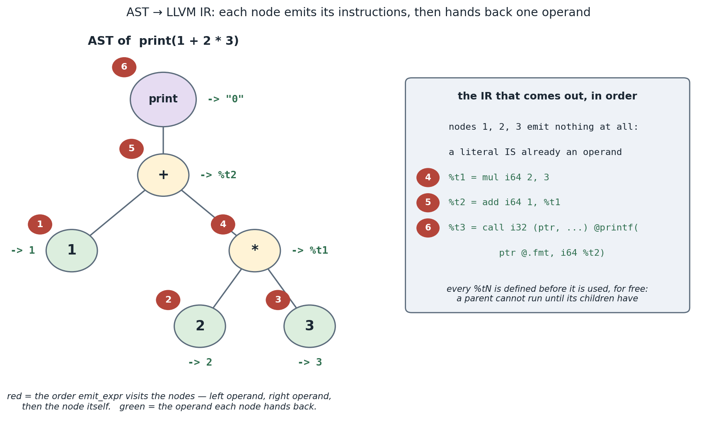

## 1. What you'll build, and why

The back half of the compiler: lower the checked AST into **LLVM IR** text, which `clang` then
turns into a native arm64 executable. After this, `swiftml build` produces real programs and the
oracle can compare them to `swiftc` byte-for-byte.

- **You implement:** `irgen.ml : emit_llvm` (this dir) — returns a complete `.ll` module as a string.
- **The driver is done for you:** `driver.ml` (this dir) writes the string to a temp `.ll` and runs
  `clang foo.ll -o foo` (clang recognizes `.ll` and runs the LLVM backend + linker).
- **Outcome:** Milestone **M1** — the Phase-1 corpus matches `swiftc`.

## 2. Concepts in depth

### LLVM IR in one page

LLVM IR is a typed assembly language in **SSA form**. Both halves of that need a word.

*Typed*: every value carries a type — `i64`, `i1`, `ptr` — and the verifier rejects a mismatch, so
a great many codegen bugs become a refusal to compile rather than a wrong program.

*SSA* — **static single assignment** — is the rule that **every register is written exactly once,
textually**. There is no "reassign `%1`". If a value changes, a *new* register holds the new value:

```llvm
%1 = add i64 %0, 1      ; not "%0 = %0 + 1" — that spelling does not exist here
%2 = mul i64 %1, 2
```

"Static" is doing real work in that name: it is one assignment per register **in the text of the
program**, not per execution — a register inside a loop is written once in the listing and once per
iteration at run time.

Why anyone bothers: it makes the question *"where did this value come from?"* free. Given `%2`,
there is exactly one instruction that defines it, so the definition is a lookup rather than a search
backwards through the code for the last store that might have run. Every optimization in Phase 4 —
constant folding, common-subexpression elimination, dead-code elimination — leans on that. It is
the single most important structural idea in modern compiler IRs, which is why it gets a whole
concept of its own (**16-mem2reg-ssa**) where you *build* SSA from scratch instead of being handed
it.

The catch is that Swift `var`s are, by definition, assigned more than once — so how does a mutable
variable live in an IR where nothing may be written twice? The classic answer, and the one we use
below, is to dodge the question: keep variables in **memory** (`alloca` + `load`/`store`), because
the SSA rule constrains *registers*, not memory cells. Every `x = …` becomes a `store` to the same
slot. That is exactly what `clang -O0` emits for C, and Phase 4's `mem2reg` pass is what later
promotes those slots into real SSA registers.

For Phase 1 you need a sliver of the language:

```llvm
; a format string and the C printf, to print an Int + newline
@.fmt = private constant [5 x i8] c"%lld\0A\00"
declare i32 @printf(ptr, ...)

define i32 @main() {
entry:
  %x = alloca i64                  ; a stack slot for a let/var
  store i64 42, ptr %x             ; let x = 42
  %1 = load i64, ptr %x            ; read x
  %2 = mul i64 %1, 2               ; x * 2
  call i32 (ptr, ...) @printf(ptr @.fmt, i64 %2)
  ret i32 0
}
```

Key facts: every computed value is a fresh `%N` register, written once and never again (that is
the SSA rule above); `i64` is our `Int`; `alloca` gives a stack slot you `store`/`load`; arithmetic
is `add/sub/mul/sdiv/srem i64`; `printf` with `%lld` prints a 64-bit int. Note how the two kinds of
name divide the work: `%x` is an *address* (what `alloca` returned) and `%1` is a *value* (what
`load` produced). Phase 4's mem2reg will *remove* the allocas by promoting them to SSA registers —
but writing them now is the simple, correct start.

### Lowering = a recursive walk that returns "where the value is"

Codegen mirrors the AST recursion. `gen_expr e` emits instructions and **returns the operand**
holding the result (a register name like `"%3"`, or an immediate like `"42"`):

```
gen_expr (Int_lit n)        = string_of_int n                      (* an immediate operand *)
gen_expr (Var x)            = emit "%k = load i64, ptr %x"; "%k"
gen_expr (Unary(Neg, e))    = let v = gen_expr e in emit "%k = sub i64 0, v"; "%k"
gen_expr (Binary(op, l, r)) = let a = gen_expr l and b = gen_expr r in
                              emit "%k = <llop op> i64 a, b"; "%k"
gen_expr (Call("print",[a]))= let v = gen_expr a in emit "call ... @printf(... i64 v)"; "0"
```

A counter hands out fresh `%k` names. Statements: `let`/`var` ⇒ allocate a slot (a map from source
name to its `%name` alloca), `gen_expr` the initializer, `store` it; assignment (`var` reuse) ⇒
`gen_expr` then `store`. Wrap it all in `define i32 @main() { entry: … ret i32 0 }` plus the
preamble.

> Oracle: `../../swift/lib/IRGen/GenExpr.cpp` does this for SIL instructions rather than AST nodes,
> emitting via LLVM's `IRBuilder`. We emit text for clarity; the structure (recursive lower,
> return an operand) is identical. Phase 2 moves this onto SIL.



*(regenerate: `make figs C=phase1-minimal/04-codegen`)*

## 3. Build it, step by step

Open `irgen.ml` in this directory. Build the module as a `Buffer.t`.

1. **Preamble:** emit the `@.fmt` constant and `declare i32 @printf(ptr, ...)`.
2. **A fresh-name counter:** `let k = ref 0 in let fresh () = incr k; "%t" ^ string_of_int !k`.
3. **A name→slot map** for `let`/`var`: `let slots : (string,string) Hashtbl.t = Hashtbl.create 16`.
   For `let x`, pick `"%x"` (sanitize/uniquify if needed) and emit `alloca i64`.
4. **`gen_expr : Ast.expr -> string`** as in §2, appending instructions to the buffer and returning
   the operand string. Map `Ast.binop` to `add/sub/mul/sdiv/srem`.
5. **`gen_stmt`** for `Let`/assignment/`Expr_stmt`; print calls go through `printf`.
6. **Wrap** in `define i32 @main() { entry: <body> ret i32 0 }` and return `Buffer.contents`.

**Tip:** keep `entry:` as a single basic block in Phase 1 (no branches yet — control flow arrives
in Phase 2). Test the raw IR directly with `dune exec swiftml -- --emit-llvm p.swift | clang -x ir
- -o p && ./p`.

## 4. Test it

```bash
make lab C=phase1-minimal/04-codegen          # compiles + runs the sample programs
make oracle F=tests/programs/arith.swift      # parity vs swiftc  (the real bar)
make oracle F=tests/programs/vars.swift
```

The cram test compiles a program with `swiftml`, runs it, and checks stdout. `make oracle` is the
headline check: identical output to `swiftc`.

## 5. Benchmark it

```bash
make bench C=phase1-minimal/04-codegen
```

Compile-time per line, and (with `v1_valuenum`) IR size / `-O0` runtime. The real perf story starts
in Phase 4 (the optimizer); here just record a baseline.

## 6. Exercises

1. Implement `v1_valuenum`: keep `let`s that are never reassigned in a `name→operand` map and skip
   the alloca/load entirely. Confirm `--emit-llvm` shrinks and output is unchanged.
2. Add a `--emit-llvm -O` path that pipes your IR through `clang -O2` and compare the runtime of a
   loop-free arithmetic-heavy program (preview of the Phase-4 optimizer handoff).
3. Make `print` of a negative number match swiftc exactly (it already should — verify, and note the
   `%lld` format).

## 7. Recap & what's next — **M1 reached**

You have a complete compiler for a real (tiny) subset of Swift: source → tokens → AST → checked AST
→ LLVM IR → native executable, matching `swiftc`. That's the whole architecture in miniature.

**Phase 2** widens the language (Bool/Double/String, `if`/`while`/`for`, functions) and — crucially
— inserts **SIL**, Swift's own SSA IR, between the AST and LLVM, so that all later optimization has
a place to live. The lowering you just wrote moves from "AST → LLVM" to "AST → SIL → LLVM."

## 8. Appendix — full solution

Mirrors `solution/irgen.ml` — the complete `emit_llvm`. **Try §3 first — this is the answer.**

```ocaml
let emit_llvm (prog : Ast.program) : string =
  let buf = Buffer.create 256 in
  let next_reg = ref 0 in
  let fresh () = incr next_reg; Printf.sprintf "%%t%d" !next_reg in
  (* name -> the `alloca` pointer register holding that binding's slot. *)
  let slots : (string, string) Hashtbl.t = Hashtbl.create 16 in
  let slot_of (name : string) : string =
    match Hashtbl.find_opt slots name with
    | Some r -> r
    | None ->
        let r = Printf.sprintf "%%%s.addr" name in
        Buffer.add_string buf (Printf.sprintf "  %s = alloca i64\n" r);
        Hashtbl.add slots name r;
        r
  in
  (* Lower an expression; return the operand string (an i64 literal or a register). *)
  let rec gen_expr (e : Ast.expr) : string =
    match e with
    | Ast.Int_lit (n, _) -> string_of_int n
    | Ast.Var (x, _) ->
        let r = fresh () in
        Buffer.add_string buf (Printf.sprintf "  %s = load i64, ptr %s\n" r (slot_of x));
        r
    | Ast.Unary (Ast.Neg, e, _) ->
        let v = gen_expr e in
        let r = fresh () in
        Buffer.add_string buf (Printf.sprintf "  %s = sub i64 0, %s\n" r v);
        r
    | Ast.Binary (op, l, r0, _) ->
        let lv = gen_expr l in
        let rv = gen_expr r0 in
        let r = fresh () in
        let opcode = match op with
          | Ast.Add -> "add" | Ast.Sub -> "sub" | Ast.Mul -> "mul"
          | Ast.Div -> "sdiv" (* Phase 1: plain signed ops; trapping div/overflow is Phase 2 *)
          | Ast.Mod -> "srem"
        in
        Buffer.add_string buf (Printf.sprintf "  %s = %s i64 %s, %s\n" r opcode lv rv);
        r
    | Ast.Call (f, args, _) ->
        if f = "print" then (
          let v = match args with [ a ] -> gen_expr a | _ -> failwith "IRGen: print arity" in
          let r = fresh () in
          Buffer.add_string buf
            (Printf.sprintf "  %s = call i32 (ptr, ...) @printf(ptr @.fmt, i64 %s)\n" r v);
          "0" (* print is Void in Swift; Phase 1 never uses its value *))
        else failwith (Printf.sprintf "IRGen: unsupported call to '%s'" f)
  in
  let gen_stmt (s : Ast.stmt) : unit =
    match s with
    | Ast.Let { name; value; _ } ->
        let addr = slot_of name in
        let v = gen_expr value in
        Buffer.add_string buf (Printf.sprintf "  store i64 %s, ptr %s\n" v addr)
    | Ast.Assign { name; value; _ } ->
        let addr = slot_of name in
        let v = gen_expr value in
        Buffer.add_string buf (Printf.sprintf "  store i64 %s, ptr %s\n" v addr)
    | Ast.Expr_stmt (e, _) -> ignore (gen_expr e)
  in
  List.iter gen_stmt prog.Ast.stmts;
  let body = Buffer.contents buf in
  (* No target triple/datalayout on purpose — the driver passes -Wno-override-module
     and clang fills in the host triple. *)
  String.concat ""
    [ "; swiftml Phase-1 LLVM IR\n";
      "@.fmt = private unnamed_addr constant [6 x i8] c\"%lld\\0A\\00\"\n\n";
      "declare i32 @printf(ptr, ...)\n\n";
      "define i32 @main() {\n";
      "entry:\n";
      body;
      "  ret i32 0\n";
      "}\n" ]
```

Why it's shaped this way:

- **Stack model.** Every binding gets an `alloca i64`; reads are `load`, writes are `store`. It's
  deliberately naive — **Phase 4's mem2reg** promotes these slots to SSA values and deletes the
  allocas/loads/stores, which is why this is the perf baseline, not the perf target.
- **`gen_expr` returns an operand string** (a literal like `7`, or a register like `%t3`), so a
  constant needs no instruction and a `Binary` emits exactly one. The `fresh` counter names temps.
- **`slot_of` is idempotent** — first use of a name emits the `alloca`; reassignment (`Ast.Assign`)
  reuses the same slot, so `c = c * 2` stores back into `%c.addr`.
- **Opaque pointers (`ptr`)** and a libc `printf("%lld\n", …)` preamble keep the IR tiny and
  portable; Phase 1 stays in a single `entry:` block (no control flow until Phase 2).

## 9. Exercise solutions

### 1 — `v1_valuenum`: skip the alloca for never-reassigned `let`s

A `let` that is never the target of an assignment is single-assignment, so it needs no stack slot —
keep its value operand in a `name → operand` map and reference it directly. First scan the program
for names that *are* reassigned (those still need the alloca/store path); everything else can be
value-numbered:

```ocaml
let reassigned : (string, unit) Hashtbl.t = Hashtbl.create 16 in
List.iter (function Ast.Assign { name; _ } -> Hashtbl.replace reassigned name () | _ -> ())
  prog.Ast.stmts;
let values : (string, string) Hashtbl.t = Hashtbl.create 16 in  (* name -> operand *)

(* in gen_expr, before the alloca path: *)
| Ast.Var (x, _) when Hashtbl.mem values x -> Hashtbl.find values x
(* in gen_stmt: a never-reassigned let binds name -> operand, emits no alloca/store *)
| Ast.Let { name; value; _ } when not (Hashtbl.mem reassigned name) ->
    Hashtbl.replace values name (gen_expr value)
```

`--emit-llvm` then has no `alloca`/`load`/`store` for those bindings and the program's output is
unchanged (assert both: shorter IR, identical stdout). This is a hand-rolled preview of **Phase 4's
mem2reg**, which does the same promotion generally, via the dominator tree.

### 2 — an `--emit-llvm -O` path

Pipe the emitted IR through clang's optimizer. Write the IR to a temp `.ll`, then shell out to
`clang -O2`:

```ocaml
(* to see optimized IR:   clang -O2 -S -emit-llvm tmp.ll -o -
   to time it:            clang -O2 tmp.ll -o tmp && ./tmp  *)
let ll = Irgen.emit_llvm prog in
let path = Filename.temp_file "swiftml" ".ll" in
(* ... write ll to path ... *)
ignore (Sys.command (Printf.sprintf "clang -O2 -S -emit-llvm %s -o -" (Filename.quote path)))
```

On a loop-free, arithmetic-heavy program, `-O2` constant-folds the entire computation down to a
single `printf` of a constant — the Phase-4 optimizer handoff in microcosm.

### 3 — negative `print` parity

Already correct — verified against the oracle: `print(-42)` → `-42`, `print(0 - 7)` → `-7`. The key
is the format string: we declare `%lld` (a **signed** `long long`), and unary minus lowers to
`sub i64 0, x`, so a negative `i64` prints with its sign exactly like swiftc. The bug to avoid is
`%llu` (unsigned), which would print `-1` as `18446744073709551615`.
