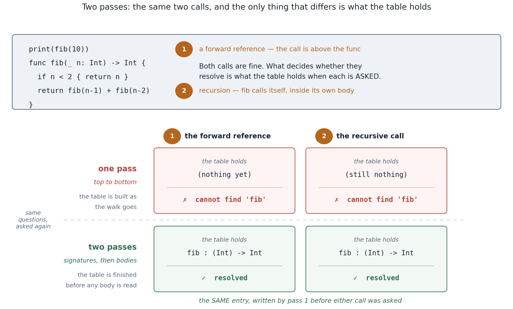

## 1. What you'll build, and why

A function is the first real **abstraction**: a named, parameterised, reusable piece of code with a
**type signature** — "give me these argument types, I'll give you back that result type." This
concept adds `func` declarations, `return`, and calls to your own functions, with the two things that
make functions powerful and that the type checker has to handle carefully: **recursion** (a function
that calls itself) and **forward references** (calling a function written later in the file).

- **You implement:** the arrow `->` (lexer), function declarations + `return` (parser), and the
  function rules in `sema.ml` — the **two-pass** check, call typing, return typing, and the
  "missing return" analysis.
- **Outcome:** your `--typecheck` agrees with `swiftc` on functions: recursion and forward refs
  accepted; wrong argument types/counts, missing returns, return-type mismatches, and stray
  top-level `return`s all rejected — `oracle.t` asks swiftc about 30 such programs on every run.
- **Out of scope:** *running* functions (that's the SIL backend, 08–09); closures and functions as
  values (Phase 7); and full **argument labels** — see the note below.

## 2. Concepts in depth

### A function is a signature plus a body

`func add(_ a: Int, _ b: Int) -> Int { return a + b }` has two parts the checker cares about:

- a **signature** — the parameter types `(Int, Int)` and the return type `Int` — which is all a
  *caller* needs to know; and
- a **body** — checked once, in its own world, where the parameters are in scope.

So the checker does two different jobs: at a **call site**, look up the signature and check the
arguments against it (count + types), yielding the return type; inside the **body**, check the
statements with the parameters bound and the return type known.

### Why two passes — the heart of this concept

If you checked top-level items strictly top-to-bottom, two everyday things would break:

- **Recursion.** `func fib(_ n: Int) -> Int { … fib(n-1) … }` calls `fib` *inside its own body* —
  before you've finished defining it.
- **Forward references.** `print(g())` can appear *above* `func g()`; Swift makes all top-level
  functions visible throughout the file.

The fix is to split checking into **two passes** (this is exactly how real compilers bind names —
`swift/lib/Sema/TypeCheckDecl.cpp` does a declaration pass before a body pass):



1. **Pass 1 — collect signatures.** Walk every `func` declaration and record its signature (param
   types, return type) in a table. Nothing in a *body* is checked yet, so order doesn't matter.
2. **Pass 2 — check bodies.** Now the table is complete, so a call to `fib` resolves while you're
   *inside* `fib`, and `print(g())` resolves even though `g` is declared later.

That's the whole trick, and it's a recurring one: separate "what does each thing's interface look
like?" from "is each thing internally correct?"

### Checking a body: a fresh scope, immutable parameters

A function body is checked in a **fresh scope** containing just its parameters — each bound as an
**immutable** value (a `let`, so `a = 5` inside the body is "cannot assign to value: 'a' is a
'let' constant"), with the function's return type recorded so every `return` can be checked
against it.

Our functions are *self-contained*: a body sees its parameters and the function table, not the
top-level variables. Real Swift lets a function read a global (and a closure capture a local —
Phase 7); we start each body from an empty `env` instead. So `let x = 1` at top level followed by
`print(x)` inside a body is "cannot find 'x' in scope" here, where swiftc accepts it. That is the
one place in this concept where we reject what swiftc accepts, and the oracle corpus stays off it.

### `return`, `Void`, and checking against the declared type

`return e` must produce the function's declared type — `check_expr e returnType`, the same
checking-mode judgment from concept 05, so an integer literal returned from a `-> Double` function
coerces. A function with no `-> T` returns **`Void`** (`()`); returning a value from it
(`return 1`) is an error, and a bare `return` from a non-`Void` function ("should return a value")
is too. And a `return` with no enclosing function — at the top level — is "return invalid outside
of a func". The return type is the contextual type that flows *into* every `return`.

### "Missing return": your first real flow analysis

A non-`Void` function must return a value **on every path**. `func f() -> Int { print(1)
print(2) }` is rejected — "missing return in global function expected to return 'Int'". Deciding
this is a tiny **flow-sensitive analysis**: a `return` definitely returns; an `if`/`else`
definitely returns iff **both** branches do (no `else` ⇒ no); a `while`/`for` never counts — the
loop might run zero times; and a block definitely returns if **any** of its statements does,
because whatever follows that statement is unreachable (`return 1` then `print(2)` still returns;
swiftc accepts it with a "will never be executed" warning).

Where swiftc does this is worth knowing, because it decides how you test it. The check is not in
the type checker at all: it runs on SIL, in the mandatory diagnostic passes
(`lib/SILOptimizer/Mandatory/DataflowDiagnostics.cpp`, `diag::missing_return_decl`), where
"every path" is literal — a walk of the function's basic blocks. So `swiftc -typecheck`
**accepts** a `-> Int` function that never returns, and the oracle in §4 runs swiftc as
`-emit-sil` to get a verdict that includes this rule. Two consequences of it living on the CFG:
swiftc knows `while true { return 1 }` and `if true { return 1 }` always return (the constant
condition folds before the check) and accepts them; our AST-level rule does not, and rejects
both. The corpus keeps its conditions non-constant so the two agree.

This is the same shape as the dead-code idea from concept 06, and a direct ancestor of Swift's
**definite-initialization** check ("variable used before being initialized"), which also runs on
the SIL control-flow graph — concept 09 shows where it would go. Today the rule is a recursion
over the AST; on a real CFG it becomes a dataflow pass over basic blocks — which is *why* control
flow (06) and functions (07) both land right before SIL (08).

### A note on argument labels (a Swift feature we simplify)

Swift parameters carry **argument labels**: `func add(a: Int, b: Int)` must be **called**
`add(a: 1, b: 2)`, not `add(1, 2)` — the label is part of the function's name (it's why the builtin
is written `print(_:)`). We check calls **positionally**, so we lean on Swift's `_` "no-label" form:
write `func add(_ a: Int, _ b: Int)` and `add(1, 2)` matches `swiftc`. The parser accepts the
optional external label and discards it. Full label checking (and overloading by label) is a
refinement for later; positional calls are enough to teach the core of the call ABI.

### The call ABI, in one breath

Type-checking a call is half the story; the other half (concepts 08–09) is *running* it. A call
evaluates its arguments, hands control to the function with those values bound to the parameters, and
the function `return`s a value and control to the caller. In SIL/LLVM that's a calling convention —
arguments in registers/stack, a return slot, a return address — and **each function is its own
control-flow graph** with its own entry and exits. You've now built every front-end piece those two
concepts need.

### The subset you are growing into

**New lexemes.** Three things the concept-06 lexer never saw. The keyword table lives in
`token.ml` (`keyword_or_ident`) and already has the two words; the arrow is the one hole:

| spelling | token | notes |
|---|---|---|
| `->` | `Token.Arrow` | maximal munch in the `'-'` arm: peek for `>`; `- >` with a space is still `Minus` `Gt` |
| `func` | `Kw_func` | a *keyword*, like `let` — starts a top-level item |
| `return` | `Kw_return` | a keyword; `return` alone or `return expr` |

`(` `)` `,` `:` all exist already (calls, `print(a, b)`, the annotation), so a parameter list is
made of old tokens in a new order. No new operator, so the precedence table is concept 06's.

**The grammar** — `<-- new` marks what this concept adds; everything else is concepts 05–06:

```
program    ::= { item NEWLINE }                                    <-- items, not statements
item       ::= func_decl                                           <-- new
             | statement
func_decl  ::= "func" ident "(" [ param { "," param } ] ")"        <-- new
               [ "->" type ] block
param      ::= [ ident | "_" ] ident ":" type                      <-- new (label dropped)

statement  ::= ("let" | "var") ident [ ":" type ] "=" expr
             | ident "=" expr
             | "if" expr block [ "else" ( block | if-statement ) ]
             | "while" expr block
             | "for" ident "in" expr "..<" expr block
             | "break" | "continue"
             | "return" [ expr ]                                   <-- new
             | expr
block      ::= "{" { statement NEWLINE } "}"
type       ::= "Int" | "Double" | "Bool" | "String" | "Void"       <-- Void is new (rarely written)

expr       ::= or
or         ::= and { "||" and }                                      (bp 3)
and        ::= comparison { "&&" comparison }                        (bp 4)
comparison ::= cast { ("==" | "!=" | "<" | "<=" | ">" | ">=") cast } (bp 5)
cast       ::= sum { "as" type }                                     (bp 7)
sum        ::= product { ("+" | "-") product }                       (bp 10)
product    ::= unary { ("*" | "/" | "%") unary }                     (bp 20)
unary      ::= "-" unary | primary
primary    ::= int | float | string | "true" | "false" | ident
             | ident "(" [ expr { "," expr } ] ")"                 <-- now reaches YOUR functions
             | "(" expr ")"
```

Three things to notice. A program is no longer a list of statements but of *items*, and a
function declaration is not a statement: `func` is only legal at top level, so `parse_program`
dispatches on `Kw_func` and everything else still goes to `parse_stmt` (nested functions are real
Swift; not in this subset). `return` is a statement with an *optional* operand, and "optional"
is decided by the next token — a newline, a `}`, or end of input means bare. And the call
production is unchanged: `f(1, 2)` parsed already in Phase 1 (for `print`); what is new is that
sema now finds `f` in a table you build.

A parameter is `[label] name : type`. Swift's `_` is an identifier-shaped token here (the lexer
treats it as an identifier), so `_ a: Int` and `from start: Int` are the same shape — two
identifiers before the colon — and `a: Int` is one. The parser keeps the *inner* name and drops
the label; the "argument labels" note above says what that costs.

### The diagnostics you emit

Same three sources as concepts 05 and 06: swiftc's `.def` files where the construct exists
(`swift/include/swift/AST/DiagnosticsSema.def` unless said otherwise), `swiftc` on the snippet to
confirm, our own wording where the subset has nothing to copy. Every line below is pinned by a
cram case, character for character.

**Lexer** — nothing new to report: `->` is a two-character token, and a `-` that is not followed
by `>` is still `Minus`.

**Parser** — the given `expect` / `parse_ident` helpers say `expected <what>`, at the token found
instead; you choose the phrase: `'('`, `a parameter name`, `':'`, `a parameter type`, `')'`,
`a function name`, `a return type`, and `parse_block`'s `'{'`. The tests pin the *first* error of
a malformed declaration only — `expect` does not skip the offending token, so what follows is
recovery noise, and a different recovery is not wrong.

**Sema** — the tests compare these character for character:

| program | our message | swiftc |
|---|---|---|
| `func f() -> Int { print(1)` `print(2) }` | `missing return in global function expected to return 'Int'` | **same** — `DiagnosticsSIL.def:320` `missing_return_decl`, `%kindonly1` = *global function* here (a method would say *instance method*) |
| `return 1` at top level | `return invalid outside of a func` | **same** — `:5301` `return_invalid_outside_func` (no quotes around `return`) |
| `func f() { return 1 }` | `unexpected non-void return value in void function` | **same** — `:804` `cannot_return_value_from_void_func`; swiftc points at the `1`, we point at `return` |
| `func f() -> Int { return }` | `non-void function should return a value` | **same** — `:5304` `return_expr_missing` |
| `func f() -> Int { return "s" }` | `cannot convert value of type 'String' to specified type 'Int'` | *cannot convert return expression of type 'String' to return type 'Int'* — `:334` `cannot_convert_to_return_type`; ours is `check_expr`'s one wording |
| `f("s")` on `f(_ x: Int)` | `cannot convert value of type 'String' to specified type 'Int'` | *… to expected argument type 'Int'* — `:382` `cannot_convert_argument_value`; same reason |
| `f(1, 2)` on a one-parameter `f` | `function 'f' expects 1 argument(s) but 2 given` | *extra argument in call* / *missing argument for parameter #2 in call* / *argument passed to call that takes no arguments* — three wordings (`:1686–1701`) for one rule; ours is the uniform form |
| `func f() { }` twice | `invalid redeclaration of 'f'` | *invalid redeclaration of 'f()'* — `:1110` `invalid_redecl` prints the full signature |
| `a = 5` on a parameter | `cannot assign to value: 'a' is a 'let' constant` | **same** — falls out of binding parameters as `let` |
| `func f(_ a: Nope) { }` | `cannot find type 'Nope' in scope` | **same** — `:1200`; swiftc points at `Nope`, we point at the `func` (a parameter carries no span) |
| `let v: Int = f()` on a `Void` `f` | `cannot convert value of type '()' to specified type 'Int'` | **same** — `Void` prints as `()` |
| `print(x)` in a body, `x` top-level | `cannot find 'x' in scope` | *accepted* — the self-contained-body simplification above |

## 3. Build it, step by step

Three skeletons; concepts 01–06 are filled in.

1. **`lexer.ml`** — in the `'-'` case, peek: if the next char is `>`, emit `Token.Arrow`; else `Minus`.
2. **`parser.ml`** — `parse_params`: consume `(`, then zero-or-more `name: Type` separated by `,`
   (accept an optional external label — a `_` or identifier before the name — and drop it), up to
   `)`. `parse_func`: `func`, a name, `parse_params`, an optional `-> Type`, then `parse_block`.
   `return`: a bare `return` if the next token ends the statement, else `return <expr>`.
3. **`sema.ml`** — four holes: **call typing** in `infer_call` (look the name up in `funcs`; check
   arity and each arg against its parameter type with `check_expr`; return the function's return
   type); **`return`** (valid only in a function — `current_ret` says whether you are in one, and
   what it returns; the value, or its absence, against the Void rules of §2); **`check_func`**
   (fresh `env`, parameters bound immutable, set `current_ret`, check the body, restore both, then
   the "missing return" rule using `block_returns`); and the **two passes** (fill `funcs` with
   signatures — a name seen twice is a redeclaration — then check each item in order). The scope
   helpers, `loop_depth`, `current_ret`, `block_returns`, and `resolve_*` are given.

   Fill the **two passes first**: they are the entry point of `check`, and until they exist no
   sema test can run — every sema file reads `TODO`. Then `check_func`, then `return`, then the
   call; §4 lists which file each one turns green.

Reference: `solution/`.

## 4. Test it

```bash
make lab C=phase2-types-flow/07-functions
```

Nine cram files, one per hole (`make lab C=… T=sema-return` runs one), two unit suites and the
oracle — in the order you fill the holes:

- `lexer-arrow.t` — `--emit-tokens`: `->` with and without spaces, `-` alone, `- >`, `a->-b`.
  Green with the lexer peek alone (the two "still minus" cases pass before you start — the given
  `-` arm already does that).
- `parser-return.t` — `--emit-ast`: `return e`, and a bare `return` before a newline, a `}`, and
  end of input. Green with the `Kw_return` arm; sema never runs, so top-level returns are fine.
- `parser-params.t` — parameter lists through `func f(…) { }`: empty, one, three, the `_`
  label dropped, a named label dropped, and the first error of five malformed lists. Needs
  `parse_params` and `parse_func` (the list is only reachable through a declaration).
- `parser-func.t` — declarations with and without `-> T`, multi-line bodies, an empty body,
  items interleaved with statements, and the first error of a nameless / typeless / bodyless
  declaration.
- `test_parser.ml` (alcotest `parser-funcs`) — the same, as AST structure, one group per hole.
- `sema-passes.t` — `--typecheck`: the two-pass driver. Its first four cases need only the
  driver (a statement-only program, a bad top-level `let`, a redeclaration, items checked in
  order); the rest are the forward reference, `fib`, `isEven`/`isOdd` and need every hole.
- `sema-func.t` — `check_func`: parameters in scope and immutable, the fresh scope (no top-level
  names, no leak), unknown types, and the missing-return rule case by case — `if` without
  `else`, a loop, both branches returning, an `else if` chain, a statement after `return`.
- `sema-return.t` — the three `return` diagnostics, the value against the return type, the
  literal-to-`Double` coercion, two bad returns in one body.
- `sema-call.t` — arity (too many, too few, an argument to `f()`, and that a wrong count does
  not also check the arguments), argument types, the result as `Int`/`Bool`/`()`, nested calls.
- `test_sema.ml` (alcotest `sema-funcs`) — the same rules in-process, one group per hole.
- `oracle.t` — **the headline**: every program in `oracle-corpus.txt` (30: twelve accepted,
  eighteen rejected, one per rule) goes to swiftc and to your `--typecheck`, and the verdicts must
  agree. swiftc runs as `-emit-sil -o /dev/null`, not `-typecheck`, because its missing-return
  check lives on SIL (§2) — `-typecheck` would accept four of the reject cases. On a
  disagreement the first line we printed is shown, so a rejection that is really an unfinished
  stage reads as what it is.

A hole you have not started shows as `TODO` with the list of what it will check; a hole in
progress shows `FAIL` with, under each failing case, what the test wants and what your code
printed. Until the two-pass driver exists every sema file is `TODO`: nothing in `check` runs
before it. To see one construct on its own:

```bash
printf 'func f(_ n: Int) -> Int {\n  if n > 0 { return 1 }\n}\n' > m.swift
_build/default/phase2-types-flow/07-functions/tests/lab.exe --typecheck m.swift
swiftc -emit-sil -o /dev/null m.swift        # what the oracle asks
```

## 5. Benchmark it

Not perf-relevant (type-check only, linear). Perf arrives in Phase 4 on SIL.

## 6. Exercises

1. **Argument labels.** Give `Ast.param` a `label : string option` and `Ast.Call` labelled
   arguments; parse `f(x: 1)`; in sema, check each argument's label matches the parameter's. Now
   `func f(a: Int)` *requires* `f(a: 1)` — true Swift.
2. **Unreachable code after `return`.** Warn on any statement following an unconditional `return` in
   the same block ("code after 'return' will never be executed"). You already have `stmt_returns` —
   walk each block and flag the tail.
3. **Mutual recursion + redeclaration.** Confirm `isEven`/`isOdd` calling each other already works
   (why? — the two passes), and that pass 1 already rejects two functions with the same name. Then
   match swiftc's form of the message — `invalid redeclaration of 'f()'` for a parameterless
   function, plain `'g'` once it has parameters (run `swiftc` on both to see) — and add a note at
   the first declaration (`note: 'f()' previously declared here`), the two-location shape from
   05's exercise 4.

## 7. Recap & what's next

You added functions: a signature/body split, the **two-pass** check that makes recursion and forward
references work, immutable-parameter scopes, return-type checking, and the "missing return"
flow analysis. With this, the **Phase-2 front-end is complete** — every program in the subset
lexes, parses, and type-checks like `swiftc` — the same verdict on the whole corpus, and swiftc's
own wording wherever the subset has the construct.

Next is the pivot the whole phase has been building toward: **08-sil-silgen** introduces **SIL**,
the intermediate representation between the AST and LLVM. SILGen lowers these checked ASTs — with
their control flow (06) and their functions (07) — into **basic blocks** joined by branches, the
form every optimization and backend needs. The tree becomes a graph; concept 09 lowers it to LLVM
and `swiftml` finally runs Phase-2 programs. (Our SIL keeps variables in memory for now — SSA
form is concept 16's lesson.)

## 8. Appendix — full solution

Mirrors `solution/sema.ml` — the function machinery. Note the two passes at the bottom, and that
`check_func` gives the body a fresh `env`.

```ocaml
and infer_call f args span : Types.ty =
  match Hashtbl.find_opt funcs f with
  | Some (ptypes, ret) ->
      let np = List.length ptypes and na = List.length args in
      if np <> na then
        err span
          (Printf.sprintf "function '%s' expects %d argument(s) but %d given" f np na)
      else List.iter2 (fun a t -> check_expr a t) args ptypes;
      ret
  | None ->
      if f = "print" then (
        (match args with [a] -> ignore (infer a)
         | _ ->
             err span "print(_:) expects exactly one argument";
             List.iter (fun a -> ignore (infer a)) args);
        Types.TVoid)
      else (err span (Printf.sprintf "cannot find '%s' in scope" f); Types.TInt)

(* return: only in a function; value checked against the return type *)
| Ast.Return (eo, span) -> (match !current_ret with
    | None -> err span "return invalid outside of a func"
    | Some rt -> (match eo with
        | Some e -> if rt = Types.TVoid then err span "unexpected non-void return value in void function"
                    else check_expr e rt
        | None -> if rt <> Types.TVoid then err span "non-void function should return a value"))

(* does a block definitely return on every path? (given) *)
let rec stmt_returns = function
  | Ast.Return _ -> true
  | Ast.If { then_blk; else_blk = Some e; _ } -> block_returns then_blk && block_returns e
  | _ -> false
and block_returns stmts = List.exists stmt_returns stmts (* the rest is unreachable *)

let check_func (f : Ast.func_decl) : unit =
  let ret = match f.Ast.ret with None -> Types.TVoid | Some n -> resolve_ty f.Ast.fspan n in
  let saved_env = !env and saved_ret = !current_ret in
  env := []; current_ret := Some ret;                 (* fresh scope; record the return type *)
  List.iter
    (fun (pr : Ast.param) ->
      bind pr.Ast.pname (resolve_ty f.Ast.fspan pr.Ast.ptype, false))
    f.Ast.params;
  List.iter check_stmt f.Ast.body;
  env := saved_env; current_ret := saved_ret;
  if ret <> Types.TVoid && not (block_returns f.Ast.body) then
    err f.Ast.fspan
      (Printf.sprintf "missing return in global function expected to return '%s'"
         (Types.string_of_ty ret))

(* PASS 1: signatures. PASS 2: bodies + top-level statements. *)
List.iter (function
  | Ast.IFunc f ->
      if Hashtbl.mem funcs f.Ast.fname then
        err f.Ast.fspan
          (Printf.sprintf "invalid redeclaration of '%s'" f.Ast.fname);
      let ptypes = List.map (fun (pr:Ast.param) -> resolve_silent pr.Ast.ptype) f.Ast.params in
      let ret = match f.Ast.ret with None -> Types.TVoid | Some n -> resolve_silent n in
      Hashtbl.replace funcs f.Ast.fname (ptypes, ret)
  | Ast.IStmt _ -> ()) prog.Ast.items;
List.iter (function Ast.IFunc f -> check_func f | Ast.IStmt s -> check_stmt s) prog.Ast.items
```

## 9. Exercise solutions

### 1 — argument labels

`Ast.param` gains `label : string option` (the external label; `None` for `_`). `Ast.Call` becomes
`Call of string * (string option * expr) list * span`. The parser reads `[label :] expr` in each
argument (an `Ident` followed by `:` is a label; otherwise it's positional). In `infer_call`, after
the arity check, verify `arg_label = param_label` for each pair, else "incorrect argument label in
call (have 'x:', expected 'y:')". Now `func f(a: Int)` rejects `f(1)` and requires `f(a: 1)`.

### 2 — unreachable code after `return`

Walk a block; once `stmt_returns` is true for a statement, every later statement in that block is
unreachable — emit a `Warning` "code after 'return' will never be executed." (Generalises to
`break`/`continue` from concept 06.) It's a one-line fold over each block, and the AST-level version
of the basic-block reachability you'll get for free once code lives on a SIL CFG.

### 3 — mutual recursion + redeclaration

`func isEven(_ n: Int) -> Bool { if n == 0 { return true }\n return isOdd(n-1) }` and `isOdd` calling
`isEven` **already type-check** — because Pass 1 records *both* signatures before Pass 2 checks
either body. That's the payoff of two passes, for free. Redeclaration is already handled: Pass 1
reports "invalid redeclaration of 'f'" when a name is added twice. For swiftc's spelling, print
`'f()'` when the function has no parameters and `'f'` otherwise, and remember each function's
declaration span in the `funcs` table so the second declaration can add
`Diagnostics.note` at the first.
