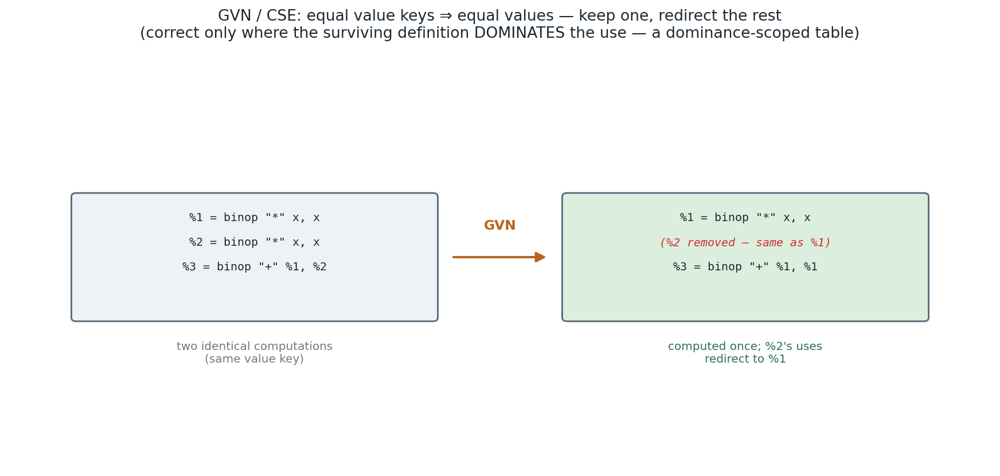

## 1. What you'll build, and why

Programs recompute things. `x*x + x*x` multiplies twice; `if a+b > 0 { use(a+b) }` adds twice;
`p.x*p.x + p.y*p.y + p.x*p.x` extracts and squares `p.x` twice. **Common-subexpression elimination
(CSE)** spots that two instructions compute the *same value* and keeps only one. The trick is doing it
**correctly**: you may only reuse a value where it's *guaranteed to have been computed* — which is a
**dominance** question, and the reason this pass walks the dominator tree you built for mem2reg.

- **You implement:** `value_key` (what makes two computations equal) and the dominance-scoped
  numbering walk.
- **Outcome:** redundant work disappears, and `-O` still matches `swiftc`.

## 2. Concepts in depth

### Value numbering: when are two computations "the same"?

The idea is to give each computation a **value number** — a canonical name for *what it computes* —
such that **equal numbers ⇒ equal values**. For a pure instruction that's just its **operation plus
the value-numbers of its operands**: `binop "*" %a %b` and `binop "*" %a %b` get the same key, so they
*are* the same value. We build that key as a string (`"bin:*:5:5"`), running each operand through
`canon` first so we compare *already-numbered* operands — that way `t = x*x; u = t*t` and a second
`t*t` recognize each other even after the first `t` was itself CSE'd.

The catch is **what counts as pure**. A `binop`, `unop`, `struct`/`enum` build, a `struct_extract` — all
deterministic functions of their operands, safe to deduplicate. But a `load` might read a different
value the second time (memory changed); an `apply` or `print` might have side effects; an
`alloc_stack` must be a *fresh* slot each time. So `value_key` returns `None` for those — they're never
CSE'd. Getting that line right is the whole correctness story for *which* instructions; dominance is
the story for *where*.

### Why you can't reuse a value just anywhere — dominance

Suppose `t = a*b` is computed in one branch of an `if`. Can the *other* branch reuse it? No — control
might not have gone through the first branch, so `t` may never have been computed. A value is only
available where its definition **dominates** the use. So CSE walks the **dominator tree** with a
**scoped table** `key → value`: entering a block, you add the expressions it computes; leaving it (and
its whole subtree), you remove them. A child block sees its ancestors' expressions (they dominate it)
but not its siblings' (they don't):



That's the difference between **local** CSE (within one block — easy, no dominance) and **global value
numbering** (across the whole function — correct because of the scope discipline). A subexpression in
an `if`'s *condition* dominates both branches, so both can reuse it; one branch's work can't leak to
the other.

### The transform

The walk produces a `replace` map (redundant value → the surviving canonical value) and a `removed`
set. Afterward we delete the redundant instructions and rewrite every operand through `canon` — so a
use of the dead `%2` becomes a use of `%1`. Because we're on SSA, rewriting is purely local: there's
exactly one definition to point at, no "which one reaches here?" to resolve. (That's the recurring
theme of Phase 4: SSA turns global questions into structural ones.)

### Where it sits, and what it unlocks

GVN runs after constant folding (so `x*0`-style folds have already happened and the *remaining*
expressions are the real ones) and feeds DCE (the redundant instruction, now unused, gets swept). It
pairs with everything: mem2reg exposed the values, folding simplified them, GVN dedupes them, and the
inliner (next concept) creates *new* redundancy across call boundaries for GVN to clean up. Optimizers
are pipelines precisely because each pass makes more work for the others.

> Oracle: swiftc's SIL `CSE` and `RedundantLoadElimination` passes; LLVM's `EarlyCSE` (a scoped
> hashtable exactly like ours) and the heavier `GVN` (which also does value *congruence* — proving
> `a+b` and `b+a` equal, and reasoning through φs).

### The key must include the result TYPE

Two instructions with the same operation and the same operands are *not* necessarily the same value.
The counter-example is a struct with no fields:

```
%1 = struct ()          : Zero
%2 = struct ()          : One
```

Same opcode, same (empty) operand list — so an operand-only key says "these are equal" and GVN
replaces every use of `%2` with `%1`. Now a value of type `One` is a value of type `Zero`, and in
Phase 5 that is a *witness table* mix-up: the dispatch site loads the method table of the wrong
conformance, and IRGen emits ill-typed LLVM. This actually happened — it shipped, and concept 21's
parity suite is what caught it.

Hence `value_key` takes the instruction's result type and folds it into the key for `Struct` and
`Enum` — the two instructions whose operands do not determine their type. Everything else is either
typed by its operands (`Binop`, `Struct_extract`) or carries its type in the key already (the
literals). The general rule is worth remembering beyond this concept: **a value-numbering key must
capture everything that distinguishes one value from another, and in a typed IR the type is part of
the value.**

## 3. Build it, step by step

In `opt.ml`:

- `value_key canon rty instr` — `TODO(18)`: return `Some key` for each **pure** instruction, building
  the key from its operation and its operands' `canon` value-numbers (use the given `_v`). Cover the
  literals, `Func_ref`, `Binop`, `Unop`, `Struct`, `Struct_extract`, `Enum`, `Enum_tag`,
  `Enum_payload`. Return `None` for `Load`/`Store`/`Apply`/`Print`/`Alloc_stack`/`Struct_element_addr`.
  **`Struct` and `Enum` must fold in the result type** (`rty`, via the given `_t ()`) — see below.
- the `visit n` DFS — `TODO(18)`: for each instruction of block `n`, look its key up in `table`; if
  present, record it redundant (`repl`, `removed`); else add `key → v` (remembering it). Recurse on
  `kids n`, then remove the keys you added (leave the scope).

Reference: `solution/opt.ml`.

## 4. Test it

```bash
make lab C=phase4-optimizer/18-cse-gvn
```

cram checks `x*x + x*x` drops to one multiply and that `-O` (including a subexpression across a branch)
matches `swiftc`. alcotest checks the value keys (equal/unequal/`None` for loads), CSE removing a
redundant multiply, CSE across a dominated join staying valid, and that two `f(5)` calls are **not**
merged.

## 5. Benchmark it

A program that recomputes a hot subexpression (a hash, an index calculation, `p.x*p.x+p.y*p.y`)
halves that work under GVN. Count the arithmetic instructions in `--sil-opt` with vs without GVN in the
pipeline. It compounds after inlining, which is exactly why the inliner runs *before* a final GVN.

## 6. Exercises

1. **Commutativity.** Normalize commutative ops (`Add`, `Mul`, `Eq`) by sorting the two operand
   value-numbers before building the key — so `a + b` and `b + a` get the *same* key and CSE merges
   them.
2. **Redundant-load elimination.** A `load` *can* be CSE'd if no `store` (to a possibly-aliasing
   address) happened in between. Add a simple alias check (same slot ⇒ may alias; different
   `alloc_stack`s ⇒ don't) and CSE loads that no intervening store could have changed.
3. **Hash-consing.** Maintain the value table across the *whole module* for constants and `func_ref`s,
   so identical literals share — a global, not per-function, numbering.
4. **Congruence GVN.** The full algorithm proves two φs equal when their corresponding inputs are
   equal (a fixed-point over an equivalence relation). Implement it and find redundancies the scoped
   hashtable misses (e.g. `x` recomputed identically down two paths that merge).

## 7. Recap & what's next

You added **GVN**: value-number each pure computation, and within the dominance scope keep one copy and
redirect the rest. SSA made "are these equal?" structural; dominance made "can I reuse it here?"
answerable. Redundant work is gone, behavior preserved.

Next, **19-inlining** — replace a call with the callee's body. It's the optimization that makes
*small functions free*, and it creates a flood of new constant-folding, CSE, and dead-code
opportunities at the call site (so the passes you've built run again, now across what used to be a call
boundary). After that, the LLVM hand-off (20) and **Milestone M4**: `swiftml -O` ≈ `swiftc -O`.

## 8. Appendix — full solution

```ocaml
let value_key (canon : Sil.value -> Sil.value) (rty : Types.ty) : Sil.instr -> string option =
  let v x = string_of_int (canon x) in
  let t () = Types.string_of_ty rty in
  function
  | Sil.Int_lit n -> Some (Printf.sprintf "int:%d" n)
  | Sil.Bool_lit b -> Some (Printf.sprintf "bool:%b" b)
  | Sil.Float_lit f -> Some (Printf.sprintf "float:%h" f)
  | Sil.String_lit s -> Some (Printf.sprintf "str:%S" s)
  | Sil.Func_ref n -> Some (Printf.sprintf "fref:%s" n)
  | Sil.Binop (op, a, b) -> Some (Printf.sprintf "bin:%s:%s:%s" (Ast.string_of_binop op) (v a) (v b))
  | Sil.Unop (op, a) -> Some (Printf.sprintf "un:%s:%s" (Ast.string_of_unop op) (v a))
  | Sil.Struct fs -> Some (Printf.sprintf "struct:%s:%s" (t ()) (String.concat "," (List.map v fs)))
  | Sil.Struct_extract (a, i) -> Some (Printf.sprintf "sext:%s:%d" (v a) i)
  | Sil.Enum (tg, p) ->
      Some (Printf.sprintf "enum:%s:%d:%s" (t ()) tg (String.concat "," (List.map v p)))
  | Sil.Enum_tag a -> Some (Printf.sprintf "etag:%s" (v a))
  | Sil.Enum_payload (a, i) -> Some (Printf.sprintf "epay:%s:%d" (v a) i)
  | Sil.Load _ | Sil.Store _ | Sil.Apply _ | Sil.Print _ | Sil.Alloc_stack _ | Sil.Struct_element_addr _ -> None

(* the dominance-scoped numbering walk *)
let rec visit n =
  let added = ref [] in
  List.iter (fun (v, instr) -> match value_key canon instr with
    | None -> ()
    | Some k -> (match Hashtbl.find_opt table k with
        | Some existing -> Hashtbl.replace repl v existing; Hashtbl.replace removed v ()
        | None -> Hashtbl.replace table k v; added := k :: !added)))
    (List.rev (blk n).Sil.instrs);
  List.iter visit (kids n);
  List.iter (fun k -> Hashtbl.remove table k) !added   (* leave the dominance scope *)
in
visit entry
```

## 9. Exercise solutions

### 1 — commutativity

In `value_key`, for `Add`/`Mul`/`Eq`/`Ne` (and `And`/`Or`), build the operand part from
`min (canon a) (canon b)` and `max …` instead of `a`,`b`. Now `a + b` and `b + a` hash identically and
CSE collapses them. (Be careful *not* to do this for `Sub`/`Lt`/etc. — those aren't commutative.)

### 2 — redundant-load elimination

During the DFS, also track, per slot, the last value stored to it on the current path. A `load slot`
can be replaced by that value if no intervening `store` to a *possibly-aliasing* slot occurred. With
our SIL, two distinct `alloc_stack`s never alias, so a load is redundant if the same slot was loaded or
stored earlier in scope with nothing clobbering it. (mem2reg already handled promotable slots; this
catches the non-promotable struct ones.)

### 3 — hash-consing

Keep a module-level table for `Int_lit`/`Bool_lit`/`String_lit`/`Func_ref` keyed by their value, mapping
to a single canonical SIL value, and share it across all functions when you build the module. Constants
become unique — a tiny global value numbering.

### 4 — congruence GVN

Initialize every value to its own class, then iterate: two `binop`s are congruent if same op and
congruent operands; two φs are congruent if same block and congruent corresponding inputs. Merge
classes to a fixed point. This proves equalities the scoped hashtable can't — e.g. a value recomputed
identically down both arms of an `if` and used after the merge — at the cost of a global fixed-point
instead of one DFS.
```
