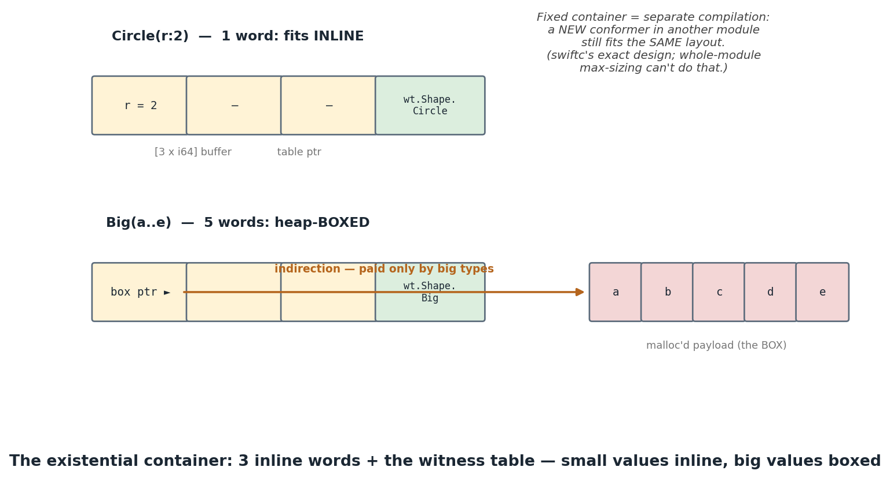

## 1. What you'll build, and why

Concept 21's existential had a quiet cheat: we sized its payload buffer to the **largest
conformer in the program**. We could, because we see the whole program — swiftc *can't*. A
library compiles `any Shape` today; your app adds a 40-field conformer tomorrow. The layout of
`any Shape` must already accommodate it — without knowing it exists. This concept adopts
swiftc's real answer — the **fixed-size existential container** with **heap boxing** — and then
uses the machinery to build a user-visible feature: **dynamic casts**, `as?` and `as!`.

- **You implement:** the inline-or-box representation (IRGen) and the cast lowerings (SILGen).
- **Outcome:** big conformers work, casts discriminate at runtime, failures abort like swiftc.

## 2. Concepts in depth

### The fixed-size container

Every `any P` value is now exactly four words: a **3-word inline buffer** plus the witness-table
pointer. (swiftc: the same 3 words + the type metadata pointer + conformance tables — see
`TypeLayout.rst`.) The fixed size is the whole point: every existential of every protocol has
the *same layout*, so code can be compiled against `any Shape` before all its conformers exist.

What if the value doesn't fit? **Box it**:



The decision is per *concrete type*, made statically (`is_boxed = words > 3`), but consumed
dynamically: a dispatch site doesn't know whether the payload is inline or boxed — only the
**thunk** does (it was compiled for one concrete type), so the unboxing lives there. That's a
recurring trick worth noticing: *push type-specific knowledge to the per-type code* (thunks),
keep the shared code (dispatch sites) uniform.

### The value witness table — taught now, real in Phase 6

Boxing raises questions the witness table can't answer: how big is the payload (to allocate)?
how do you *copy* it (a box copy should share-and-retain, an inline copy is bitwise)? how do you
*destroy* it? swiftc's answer is the **value witness table**: every type carries a table of
exactly these operations (size, stride, flags, copy×4, destroy, …), and generic/existential code
manipulates values *only* through it. Ours is degenerate — and it's worth being precise why:

- our payloads are **PODs** (plain bits, no pointers to owned memory) → copy = bitwise;
- they're **immutable through existentials** (no `mutating` dispatch) → sharing a box on copy
  is unobservable — we get copy-on-write with no writes, for free;
- nothing needs destruction → destroy = no-op… which also means **our boxes leak**. That is the
  honest v0 cost, fixed properly by ARC in Phase 6 — at which point the value witness table
  stops being degenerate and its copy/destroy entries become retain/release calls.

So the only witness we *materially* need today is `size` — and it's static. The lesson is the
*shape* of the design; Phase 6 fills in the substance.

### Dynamic casts: type identity is table identity

`if let c = s as? Circle` asks a question the static types can't answer: *what's in the box?*
The runtime answer is beautifully cheap: the existential already carries a pointer that is
unique per (type, protocol) — the **witness table**. So:

```
same = (s.table == @wt.Shape.Circle)      // one pointer compare
```

That's our `same_witness` instruction. (swiftc compares **type metadata** instead — same idea,
one level more general; `Casting.cpp` is a deep rabbit hole because of classes, bridging, and
subtyping, none of which exist here yet.) On top of the test:

- **`as?`** builds an `Optional<Circle>` across a diamond — *exactly* the coalesce pattern from
  concept 13: test, open-and-wrap `.some` in the proven branch, `.none` in the other, merge
  through a slot. Note the discipline: `open_existential` appears **only in the branch where
  the test proved the type** — opening an existential that holds something else would read a
  box pointer that isn't one.
- **`as!`** is test-or-die: the fail block terminates in `Abort` — SIGABRT, **exit 134**,
  matching swiftc (and deliberately distinct from force-unwrap's SIGTRAP/133; swiftc's message
  includes module-qualified names and raw addresses, so we match the exit code, not the text).
- A cast to a type that doesn't conform at all has **no table to compare against** — it is
  statically always-false. We emit `false` (and sema warns with swiftc's words:
  `cast from 'any P' to unrelated type 'C' always fails`).

### The subset you are growing into

**New lexemes.** None. `as` has been a keyword since concept 13 (the static `e as T`
ascription), and `?` and `!` since concept 13 as well; what is new is the *sequence*
`as` `?` and `as` `!`, and the lookahead that keeps the three readings apart:

| input | reading | how the parser decides |
|---|---|---|
| `e as T` | static ascription, `Ast.Ascribe` | infix `as` whose NEXT token is neither `?` nor `!` |
| `e as? T` | conditional cast, `Ast.Cast (…, conditional = true)` | postfix: `as` followed by `Question` |
| `e as! T` | forced cast, `Ast.Cast (…, conditional = false)` | postfix: `as` followed by `Bang` |

The casts live in `parse_postfix`, not in the infix loop, because their result is itself a
postfix operand: `(p as? A)` can be followed by more postfix. A lone `as` followed by anything
else is `expected '?' or '!' after 'as' (only as?/as! in this subset)`.

**The grammar** — `<-- new` marks what this concept adds; everything else is concepts 05–22.
Notation is EBNF: `[ x ]` is *optional* (zero or one), `{ x }` is *repetition* (zero or more),
`|` separates alternatives, and quoted text is a terminal.

```
expr        ::= ternary
ternary     ::= coalesce [ "?" expr ":" ternary ]                      (bp 2)
coalesce    ::= or { "??" or }                                         (bp 6)
or          ::= and { "||" and }                                       (bp 3)
and         ::= comparison { "&&" comparison }                         (bp 4)
comparison  ::= cast { ("==" | "!=" | "<" | "<=" | ">" | ">=") cast }  (bp 5)
cast        ::= sum { "as" type }                                      (bp 7)
sum         ::= product { ("+" | "-") product }                        (bp 10)
product     ::= unary { ("*" | "/" | "%") unary }                      (bp 20)
unary       ::= "-" unary | postfix
postfix     ::= primary { "." ident [ "(" [ arg { "," arg } ] ")" ]
                        | "!"
                        | ("as?" | "as!") ident }               <-- new (a STRUCT name only)
```

Two things to notice. The target of a dynamic cast is an `ident`, not a full `type` — v0 casts
to a concrete struct, so `as? P` (protocol-to-protocol) and `as? Int?` are out; a non-struct
target is `cannot cast to non-struct type 'X' in this subset`. And the cast binds tighter than
every infix operator, because it is postfix: `p as? A` is a complete operand, which is why
`if let a = p as? A` reads the way it does.

### The diagnostics you emit

All of these are GIVEN — this concept's holes are in SILGen and IRGen — but the lowering may
assume every rule has already fired, and `sema-subset.t` keeps them on record. Wording follows
`swiftc -typecheck` where the subset lets it (`swift/include/swift/AST/DiagnosticsSema.def`,
line numbers from the pinned snapshot).

| program | our message | swiftc |
|---|---|---|
| `p as? C` where `C` does not conform to `P` | **warning:** `cast from 'any P' to unrelated type 'C' always fails` | **same** (`downcast_to_unrelated`, l.1510) — a warning in both, so the program still builds and the cast is always `nil` |
| `a as? A` where `a` is already an `A` | `cannot cast a value of type 'A' (only existentials support as?/as! in this subset)` | **accepted** with its own warning (`conditional cast always succeeds`) — swiftc's casts cover classes, bridging and subtyping; ours only ask "what is in this box?" |
| `p as? Nope` | `cannot find type 'Nope' in scope` | **same** (`cannot_find_type_in_scope`, l.1201) |
| `p as? Int` | `cannot cast to non-struct type 'Int' in this subset` | **accepted** (and warned as always-failing) — our own words, for a v0 limit swiftc does not have |
| `let a: A = p as? A` | `cannot convert value of type 'A?' to specified type 'A'` | **same shape** — `as?` is `T?` and `as!` is `T` in both |
| `p as` with no `?`/`!` and no type | `expected '?' or '!' after 'as' (only as?/as! in this subset)` | a parse error in both, worded differently |

Everything else this concept can report — the conformance errors, the aggregate refusals, the
`let` property — is inherited unchanged from concept 21; §2 of that explainer has the table.

### One more driver lesson

That warning exposed a gap: our `--typecheck` only printed diagnostics when there were
*errors*. Warnings vanished — and the cram test caught it by *deleting our expected warning
line* during promotion. (Read your promoted diffs!) The driver now prints all diagnostics and
fails only on errors, like swiftc.

> Oracle: `swift/docs/ABI/TypeLayout.rst` §Existential Container; `GenExistential.cpp` (the
> 3-word buffer is `NumWords_ValueBuffer`); `Casting.cpp` for the full dynamic-cast lattice.

## 3. Build it, step by step

Three holes in two files. The IRGen pair comes first: until the container can be written and
read, *no* existential program lowers at all, cast or no cast.

1. **`irgen.ml` — the write** (`TODO(23b)`, in `Init_existential`). You are given the site's
   buffer alloca (`%exN`, `[3 x i64]`), the payload value, and two helpers: `words t` is a
   type's size in 64-bit words and `is_boxed sname` is `words > 3`. Put the payload where the
   container expects it. For a type that fits, that is a store into the buffer. For one that
   does not, allocate a box with `@malloc` (its size in *bytes*), store the payload into the
   box, and store the box POINTER into the buffer — word 0, which is where the read will look.
   The three lines after the hole already load the buffer back and pair it with the table, so
   what you owe them is a correctly filled `%exN`.
2. **`irgen.ml` — the read** (`TODO(23c)`, in `Open_existential`). The mirror image, from the
   same `buf`: one load for a type that fits, two for a boxed one. Get this wrong in the
   direction that reads the box pointer as if it were the value and you will print an address.
3. **`silgen.ml` — the two casts** (`TODO(23a)`, the `Ast.Cast` arm). The `same` value is
   already computed above the hole — a `Same_witness` when the target conforms, a constant
   `false` when it cannot. `as?` builds an `Optional<T>` across a diamond, and it is *exactly*
   concept 13's coalesce shape: a slot, a `cond_br`, `.some` of the opened value on one side,
   `.none` on the other, a merge that loads the slot. `as!` is the same test without a `.none`
   side: the failing block terminates in `Sil.Abort`, the way `Force_unwrap`'s failing block
   terminates in `Trap`.

The discipline that matters in step 3: `Open_existential` may appear **only** on the branch the
test proved. Opening a container that holds something else reads a box pointer that is not one.

Reference: `solution/irgen.ml`, `solution/silgen.ml`.

## 4. Test it

```bash
make lab C=phase5-generics/23-existentials                   # everything
make lab C=phase5-generics/23-existentials T=irgen-box       # one hole
```

One cram file per hole, in fill order:

| file | goes green when | how it checks |
|---|---|---|
| `tests/irgen-box.t` | `TODO(23b)` + `TODO(23c)` | `--emit-llvm`: the same `%any.P = type { [3 x i64], ptr }` for a two-word and a five-word conformer, no `malloc` for the one that fits, `@malloc(i64 40)` for the one that does not, and a boxed payload read back through a generic's open |
| `tests/silgen-casts.t` | `TODO(23a)` lowers the casts | `--emit-sil`: the `as?` diamond (one `same_witness`, an `open_existential` on the proven branch only, the two `enum` tags), `as!` ending in `abort`, and a non-conforming target lowering to `integer_literal $Bool, false` with no `same_witness` at all |
| `tests/run-existentials.t` | all three | the programs **run**, at `-Onone` and `-O`: a boxed conformer through functions, a `var`, a cast and a generic; `as?` discriminating by dynamic type; a cast in a loop whose answer changes; and a failing `as!` exiting 134, beside swiftc's own binary doing the same |

Two files do not belong to a hole. `tests/sema-subset.t` is GIVEN code and green from the start:
the aggregate refusals inherited from concept 21 plus this concept's cast rules, including the
always-fails WARNING (a warning, so exit 0 — and `--typecheck` has to print warnings for that
case to exist at all; see the driver story in §2). And `tests/oracle.t` is the headline: 16
programs where `swiftc -typecheck` and `--typecheck` must reach the same verdict, then 15 built
**four ways** — `swiftc -Onone`, `swiftc -O`, `./lab.exe build`, `./lab.exe build -O` — all run,
stdout and exit code identical.

`make lab` distinguishes three kinds of red. **TODO** means nothing in that file passes — the
hole has not been started. **FAIL** means *some* cases pass: you are mid-hole, and the diffs are
worth reading (`DETAIL=1`). **SKIP** means a compile error stopped dune first. On the untouched
skeleton all three hole files read TODO, `sema-subset.t` reads PASS, and `oracle.t` reads FAIL —
its front-end half is green, because sema is given here and only the lowering is yours.

## 5. Benchmark it

Compare a hot loop over inline conformers vs boxed ones: the box adds a malloc at creation and
a pointer chase per use. Then check what `-O` does to a *monomorphic* boxed loop — LLVM can
hoist the load but can't remove the allocation. (Specialization — next — removes the entire
container.)

## 6. Exercises

1. **Free the box (pre-ARC).** Our boxes leak. Add a `dealloc_box` emitted when an existential
   *local* goes out of scope without escaping (no stores to other slots, no returns, no calls
   taking it). It's a taste of the escape analysis ARC optimization needs.
2. **`is` checks.** `s is Circle` is `same_witness` without the open — wire the syntax and
   constant-fold it when the static type already decides.
3. **Casting between protocols.** `s as? (any Q)` succeeds when the dynamic type also conforms
   to Q — your witness tables can't answer that (they're per-(type, protocol)); sketch the
   registry you'd need (swiftc: conformance records keyed by type metadata).
4. **A real value witness table.** Emit `@vwt.S = { size, copy_fn, destroy_fn }` per struct and
   route `init_existential`/`open_existential` through it instead of static `is_boxed` — the
   refactor swiftc's layering forces, and Phase 6's starting point.

## 7. Recap & what's next

The existential container is **fixed-size** — 3 inline words + the table — so separately
compiled worlds agree on layout; big values pay a box. Type identity rides the table pointer,
which makes `as?` one compare + a proven-branch open, and `as!` the same with an abort. The
value witness table is the design that generalizes all of this past PODs — Phase 6 makes it
real.

Next, **24-specialization** — the Phase-5 finale and Milestone **M5**: the optimizer clones
generic functions per concrete type, devirtualizes witness dispatch into direct calls, and the
Phase-4 pipeline erases the entire abstraction cost you've been carefully measuring.

## 8. Appendix — full solution

```ocaml
(* irgen 23b: inline-or-box write *)
(if is_boxed sn then (
   let box = fresh () in
   p (Printf.sprintf "  %s = call ptr @malloc(i64 %d)\n" box (8 * words (Types.TStruct sn)));
   p (Printf.sprintf "  store %%%s %s, ptr %s\n" sn (op pv) box);
   p (Printf.sprintf "  store ptr %s, ptr %s\n" box buf))
 else p (Printf.sprintf "  store %%%s %s, ptr %s\n" sn (op pv) buf));

(* irgen 23c: inline-or-box read *)
if is_boxed sn then (
  let bp = fresh () in
  p (Printf.sprintf "  %s = load ptr, ptr %s\n" bp buf);
  p (Printf.sprintf "  %s = load %%%s, ptr %s\n" (op v) sn bp))
else p (Printf.sprintf "  %s = load %%%s, ptr %s\n" (op v) sn buf)

(* silgen 23a: the casts *)
if conditional then (
  let optty = Types.TOptional (Types.TStruct sn) in
  let slot = emit b (Sil.Alloc_stack "cast") optty in
  let yes = new_block b and no = new_block b and merge = new_block b in
  terminate b (Sil.Cond_br (same, (yes.Sil.bid, []), (no.Sil.bid, [])));
  switch_to b yes;
  let pv = emit b (Sil.Open_existential (ev, sn)) (Types.TStruct sn) in
  let somev = emit b (Sil.Enum (1, [ pv ])) optty in
  ignore (emit b (Sil.Store (somev, slot)) Types.TVoid);
  terminate b (Sil.Br (merge.Sil.bid, []));
  switch_to b no;
  let nonev = emit b (Sil.Enum (0, [])) optty in
  ignore (emit b (Sil.Store (nonev, slot)) Types.TVoid);
  terminate b (Sil.Br (merge.Sil.bid, []));
  switch_to b merge;
  emit b (Sil.Load slot) optty)
else (
  let ok = new_block b and fail = new_block b in
  terminate b (Sil.Cond_br (same, (ok.Sil.bid, []), (fail.Sil.bid, [])));
  switch_to b fail;
  terminate b (Sil.Abort (Printf.sprintf "Could not cast value to '%s'" sn));
  switch_to b ok;
  emit b (Sil.Open_existential (ev, sn)) (Types.TStruct sn))
```

## 9. Exercise solutions

### 1 — freeing non-escaping boxes

A local existential escapes if its value flows into: a `store` to another slot, a `return`, a
call argument, or a struct/enum constructor. Walk the function's SIL backward from the
`init_existential`; if no use escapes, emit `call void @free(ptr %box)` at the end of the
value's live range (after its last use). This is precisely the lifetime question ARC answers
with refcounts — doing it statically here shows why refcounts are the *general* answer.

### 2 — `is`

Parse `e is T` as a Bool expression lowering to `Same_witness` (or `Bool_lit` when
non-conforming). Constant-fold: if the operand's *static* type is already concrete (not an
existential), the answer is known — swiftc warns `'is' test is always true` there; match it.

### 3 — protocol-to-protocol casts

Table identity can't answer "does the dynamic type conform to Q?" — the table in hand proves P
only. You need a global registry: for each struct, the list of (protocol, table) pairs — i.e.
swiftc's conformance records. The cast walks the dynamic type's records looking for Q, then
re-wraps with Q's table. Sketch: emit `@conformances.S = [ (P, wt.P.S), (Q, wt.Q.S) ]` and a
runtime lookup loop; the metadata pointer (not the witness table) becomes the identity — which
is exactly why swiftc separates the two.

### 4 — a real vwt

`@vwt.S = { i64 size, ptr @copy.S, ptr @destroy.S }` with `copy.S` = memcpy (POD) and
`destroy.S` = no-op. `init_existential` loads size from the vwt to decide inline-vs-box at…
compile time still (it's a constant load LLVM folds) — the point of the refactor is that when
Phase 6 makes copy/destroy non-trivial, *only the vwt entries change*, not the container
protocol. That's the layering swiftc maintains.
```
