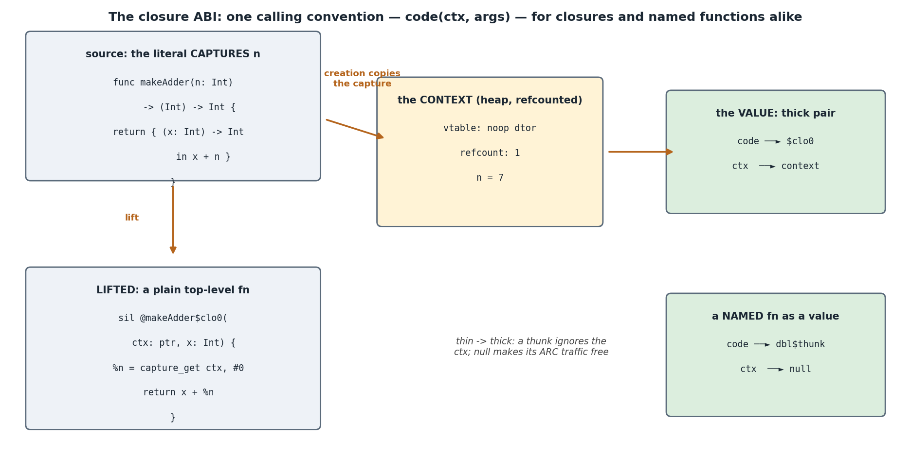

## 1. What you'll build, and why

Every function so far has been a *name* — something you call, never something you *hold*. This
concept makes functions **values**: `(Int) -> Int` becomes a type you can store, pass, and
return; `{ (x: Int) -> Int in x + n }` becomes an expression — one that **captures** `n` from
its surroundings and carries it along. Closures are the feature that makes `map`/`filter`
possible (concept 32 is built on them), and their implementation is one of the great compiler
lessons: a closure is *not* magic — it's a plain function plus a record, wearing a trench
coat.

- **You implement:** the lifting (SILGen) and the indirect call (IRGen).
- **Outcome:** higher-order programs matching swiftc at `-Onone` and `-O`.

## 2. Concepts in depth

### The problem: code is static, environments aren't

`makeAdder(7)` must return something that *remembers* 7; `makeAdder(9)` must return something
that remembers 9 — from the *same compiled code*. Machine code can't hold a different `n` per
call. The classic solution (Landin, 1964 — older than most languages) is to split the closure
into the two things it actually is:



- **the code**: the body, *lifted* to an ordinary top-level function with one extra
  parameter — the context. Free variables become `capture_get` loads from it. Compiled once,
  like any function.
- **the environment**: a heap record holding the captured *values*, created fresh at each
  closure expression. `makeAdder(7)`'s context holds 7; `makeAdder(9)`'s holds 9.

A function **value** is the pair `{ code ptr, context ptr }` — the *thick* function (swiftc's
term, and ours: `%thickfn = type { ptr, ptr }`). Calling one is mechanical: extract both,
`call code(ctx, args)`. You'll write exactly that.

### Capture semantics: by value, at creation

What does `{ ... x + n ... }` capture — the *variable* `n`, or its *value*? Swift's default
for a `var` is the variable (mutations are shared with the closure — implemented with heap
boxes); a capture *list* `[n]` copies the value at creation. **v0 implements the capture-list
semantics implicitly**: free variables are evaluated at the closure expression and copied
into the context, immutable forever after. It's the simpler model, it's honest Swift (just
spelled `[n]` there), and the box machinery for shared mutable captures is the chapter's
classic exercise. Two consequences the tests pin: each creation mints an *independent*
context (`add7`/`add9` don't interfere), and the captured value is the value *then* (the
`Box`/`reader` probe: the class dies at scope exit because the closure captured `b.v`'s Int,
not `b`).

What can be captured? PODs — `Int`, `Bool`, structs, enums. Classes and function values are
**rejected** in v0 — whether you name one or call one: their context slot would need a retain at creation and a release at
context destruction — per-type copy/destroy entries in the context's vtable, which is
precisely the value-witness design from concept 23 knocking again. (Exercise 3; the rejection
message points the way. Refusing the *call* as well as the name is not pedantry: while it was
allowed, a closure that called a captured closure compiled cleanly and printed the wrong
number, because the inner context was released at the enclosing function's scope exit and then
called through anyway.)

### Thin, thick, and the thunk

`let g = dbl` — a named function as a value — has no captures, so what's its context? Null.
But there's a wrinkle worth savoring: `dbl(Int)` was compiled *without* a context parameter,
and every indirect call site passes one. The fix is a **thunk**: `dbl$thunk(ctx, x)` ignores
`ctx` and tail-calls `dbl(x)`. The pair is `{ dbl$thunk, null }`, and one calling convention
serves everything — that uniformity *is* the ABI. (swiftc: `thin_to_thick_function`, and its
thunks live in `SILGenPoly.cpp` next to the witness thunks from concept 21 — adapter thunks
are a compiler's duct tape, and by now you've built three kinds.)

The null context also explains a runtime tweak: contexts are refcounted objects (header,
vtable with no-op destructors, the works — Phase 6's machinery reused wholesale, `TFunc`
simply joining `TClass` as a *managed* type), and `rt.retain`/`rt.release` gained a
null-guard so thin functions' ARC traffic costs one branch, taken never.

### The subset you are growing into

**New lexemes.** One punctuation token, and one keyword you already had put to a second use:

| spelling | token | notes |
|---|---|---|
| `@` | `Token.At` | an attribute marker, `@escaping`. Added to `lexer.ml`'s punctuation table |
| `in` | `Token.Kw_in` | already a keyword since `for x in …` (concept 06); it now also separates a closure's signature from its body |

**The grammar** — `<-- new` marks what this concept adds; everything else is concepts 05-28.
Notation is EBNF: `[ x ]` is *optional* (zero or one), `{ x }` is *repetition* (zero or more),
`|` separates alternatives, and quoted text is a terminal.

```
type        ::= [ "any" ] ident [ "?" ]
              | "(" [ type { "," type } ] ")" "->" type              <-- new
                (a FUNCTION type; written canonically, e.g. "(Int,Bool)->Int",
                 and split apart again by Types.split_fn_written)

param       ::= [ "@" ident ] [ ident ] ident ":" type               <-- "@" ident is new
                (the attribute is parsed and ACCEPTED; see the divergence below)

primary     ::= …
              | closure                                              <-- new
closure     ::= "{" "(" [ cparam { "," cparam } ] ")" "->" type
                    "in" expr "}"                                    <-- new
cparam      ::= ident ":" type                                       <-- new
                (v0: parameter types are WRITTEN, never inferred, and the
                 body is a single EXPRESSION — no statements, no `return`)

postfix     ::= primary { "." ident [ "(" [ arg { "," arg } ] ")" ]
                        | "(" [ arg { "," arg } ] ")" | "!"
                        | ("as?" | "as!") ident }
                (a call whose callee is a NAME bound to a function type is now
                 an indirect call through the pair, not a direct `apply`)
```

Three things to notice, and one that is deliberately absent. A function type is written in
*type* position, so it can annotate a `let`, a parameter or a return — that is what makes
`(Int) -> Int` a first-class type rather than a calling convention. A closure literal is an
*expression*, so it goes wherever an expression goes, including an argument list:
`apply({ (x: Int) -> Int in x * x }, 9)` parses with no special rule. And a bare `ident` in
call position no longer means "a declared function": sema looks in the environment first, and
a local of function type turns the call indirect. What is absent is **trailing-closure syntax**
(`a.map { … }`) and the `$0` shorthand: both are parser sugar over exactly this production,
and both are exercises in concept 32, where they earn their keep.

`@escaping` is parsed and then ignored, which makes us *more* permissive than swiftc: a program
it rejects for letting a non-escaping parameter escape compiles here. That is the one place in
this concept where our subset is larger rather than smaller, and it is stated in the table
below.

### The diagnostics you emit

None of these come out of the two holes — the holes are lowerings, and a lowering that is wrong
produces bad code, not a bad message. They are all given, and `sema-captures.t` keeps the
interesting ones on record. Wording follows `swiftc` where the subset lets it; the divergences
are stated, not hidden.

| program | our message | swiftc |
|---|---|---|
| `f = { … }` where `f` is a `let` | `cannot assign to value: 'f' is a 'let' constant` | **same** (`assignment_lhs_is_immutable_variable`) |
| `let h: (Bool) -> Int = g` for `g: (Int) -> Int` | `cannot convert value of type '(Int) -> Int' to specified type '(Bool) -> Int'` | **same**, character for character |
| `apply(5, 1)` where the parameter is `(Int) -> Int` | `cannot convert value of type 'Int' to specified type '(Int) -> Int'` | `… to expected argument type '(Int) -> Int'` — swiftc names the *site*; we have one wording for all coercions |
| `let n = 5` then `n(1)` | `cannot call value of non-function type 'Int'` | **same** (`cannot_call_non_function_value`). It used to say "cannot find 'n' in scope", which is false — `n` is right there |
| `f(1, 2)` for a one-parameter `f` | `function value 'f' expects 1 argument(s) but 2 given` | `extra argument in call` — swiftc reports at the extra argument, we report the arity at the call |
| `let f: (Int) -> Bool = { (x: Int) -> Int in x }` | `cannot convert value of type '(Int) -> Int' to specified type '(Int) -> Bool'` | `declared closure result 'Int' is incompatible with contextual type 'Bool'` — swiftc points inside the literal; both refuse |
| `{ (x: Int) -> Int in x + y }` with no `y` | `cannot find 'y' in scope` | **same**. Reported ONCE: the body used to be inferred *and* checked, so every error in a closure came out twice |
| `let k = K()` then `{ () -> Int in k.v }` | `cannot capture 'k' in this subset (closure captures are plain values)` | **swiftc accepts.** Capturing a class needs a retain at creation and a release at context destruction — per-type copy/destroy entries the context's no-op vtable does not have (exercise 3) |
| `let inner = mkAdd(n)` then `{ (x: Int) -> Int in inner(x) }` | the same message, for the same reason | **swiftc accepts.** Calling a captured function value copies the `{code, ctx}` pair in without retaining the context. Left accepted, this MISCOMPILED — `compose(3)(4)` printed 8 where swiftc prints 14 |
| `print(P(x: 1, y: 2))` | `cannot print a value of type 'P' (only Int, Double, Bool and String)` | **swiftc accepts** and prints `P(x: 1, y: 2)`. Printing an aggregate needs reflection; ours lowers a scalar |
| `a == b` on two structs | `binary operator '==' cannot be applied to two 'P' operands` | **same** — a struct is not `Equatable` unless it says so. This one used to reach IRGen and emit `add i64 %struct`, which clang refuses |
| `p.x = 9` on a `let` property | `cannot assign to property: 'x' is a 'let' constant` | **same** (`assignment_lhs_is_immutable_property`) |
| `@escaping` on a parameter that escapes | *(nothing)* | swiftc tracks escaping and reports `escaping_non_escaping_param`. We parse the attribute and accept every program: a divergence in the permissive direction, and exercise 4 |

### The verifier strikes again (twice)

Concept 27's ownership verifier ran on the first closure program and rejected it — twice
over, both real bugs, both fixed before anything executed:

- `Closure` results weren't marked **owned** — so `let d = {...}` treated the fresh value as
  a borrow, *copied* it (a spurious retain), and the original +1 leaked: `owned value %4 is
  leaked (never consumed)`. One `mark_owned` fixed creation everywhere.
- `TFunc` parameters were still **spilled to stack slots** — the entry store consumed a
  guaranteed value, exactly the flaw the verifier caught for class params in 27. The
  managed-param rule just needed to include function types.

This is the payoff of building the checker *before* the feature: new language features
arrive with their ARC discipline machine-checked from the first compile.

> Oracle: swiftc lowers closures to `partial_apply` over a captured-arguments convention
> (`SILGenFunction.cpp`); our `Closure` instruction is its monomorphic little sibling.
> `GenFunc.cpp` shows the same `{ ptr, ptr }` pair at the LLVM level.

## 3. Build it, step by step

1. **`silgen.ml` — `TODO(29a)`, the lifting** (the FV analysis `fv_expr` and the capture-name
   filtering are given): evaluate each capture (`gen_expr` of the `Var`), build the layout;
   name the lifted function `b.fname ^ "$clo" ^ counter`; `lower_func ~prologue` with the
   context as parameter 0 (typed `TClass "$ctx"` — a managed borrow that never spills) and
   the body as a single `Return`; the prologue binds each capture via `Capture_get` into
   `borrows`; patch an unannotated return type from the lifted body's actual `Return`; record
   the layout in `b.lifted`; emit `Sil.Closure` and **`mark_owned`** it.
2. **`irgen.ml` — `TODO(29b)`, the call**: extract field 0 (code) and field 1 (context) from
   the `%thickfn` pair, call `code(ctx, args...)` — void results use a bare `call void`.

Reference: `solution/silgen.ml`, `solution/irgen.ml`.

## 4. Test it

```bash
make lab C=phase7-closures-stdlib/29-closures
```

Six files, and the order they go green in is the order you fill the holes.

- **`tests/sema-captures.t`** and **`tests/silgen-stores.t`** are green before you start. They
  are the given code: the capture discipline, the two aggregate rules, the optional-field and
  `self.v` stores, an `Int` literal beside a `Double`. Read them first — they are the map of
  what your lowering may assume.
- **`tests/silgen-lifting.t`** is `TODO(29a)`. It uses `--emit-sil`, which stops before IRGen,
  so it reads the lifting alone: the lifted function and its context parameter, `capture_get`
  at index 0, one `closure` per literal numbered `$clo0`, `$clo1`, an empty context for a
  capture-free literal, a struct-typed context slot. The last case runs the compiler and expects
  no output at all — the driver runs concept 27's ownership verifier on every compile, so a
  lifting that forgets `mark_owned` fails to compile rather than merely leaking.
- **`tests/irgen-call.t`** is `TODO(29b)`. Its first case is a NAMED function used as a value,
  which needs no lifting at all — so this hole can be finished, and read, on its own.
- **`tests/oracle.t`** is the headline, and it asks swiftc every run. Twenty programs are
  type-checked by both compilers and must reach the same verdict; twenty more are compiled four
  ways — `swiftc -Onone`, `swiftc -O`, `./lab.exe build`, `./lab.exe build -O` — and all four
  must print the same bytes and exit the same way. The runtime twenty are the concept's whole
  story: literals of every result type, higher-order functions taking a named function and a
  literal, independent adder contexts, a reassigned function-typed `var`, struct and enum and
  optional captures, closures created inside a loop, a closure built in each arm of an `if`, and
  the `Box` probe, whose output pins *when* something happens rather than what it computes.
- **`tests/test_closures.ml`** is the same ground reached from OCaml rather than the CLI: the
  lifted function's parameter list, the closure layout, instruction counts, `Sil.verify_ownership`
  on generated SIL, and the given rules as accept/reject pairs.

Reading the report: a hole you have not touched shows as `TODO … not started` — the file lists
what it *will* check and stops. A hole in progress shows `FAIL` with the passing cases still
marked `OK`; that mixed line is the progress signal. `oracle.t` is `FAIL` rather than `TODO`
from the start, because its front-end half passes before you write a line of lowering; its
runtime half stops at the first `failwith` and says so.

## 5. Benchmark it

Time a hot loop calling a closure-typed parameter vs a direct call: the indirect call costs
two extracts + a pointer call, and — the real price — an inliner wall (the callee is a
runtime value). Then check what our `-O` does when the closure is locally provable
(`let f = {...}; f(x)` in one function): nothing yet — `apply_value` of a known `Closure` is
the devirtualization exercise, and you have all the machinery from concepts 24/28 to build
it.

## 6. Exercises

1. **Closure devirtualization.** `apply_value %f` where `%f`'s def is `Closure`/
   `Thin_to_thick` (concept 24's `wrap_of` pattern): rewrite to a direct call passing the
   context — then the inliner fires and `let f = {...}; f(2)` folds to a constant.
2. **Mutable captures (boxes).** Swift's default `var` capture shares mutation: allocate the
   variable in a heap box (refcounted), capture the box pointer, and make loads/stores go
   through it — inside *and* outside the closure. (This is `alloc_box` in swiftc, and why
   "captured by reference" and ARC are inseparable.)
3. **Managed captures.** Allow capturing classes/function values: the context's vtable slots
   stop being no-ops — slot 1 (destroy) releases each managed capture. You're writing the
   context's value-witness entries; concept 23's exercise 4 was the rehearsal.
4. **`@escaping` checking.** Track which function-typed *parameters* flow into stores,
   returns, or captures; reject unless declared `@escaping` (we currently accept-and-ignore
   it — match swiftc's error wording).
5. **Multi-statement bodies.** `{ (x: Int) -> Int in let y = x * 2; return y + 1 }` — reuse
   `parse_block`; sema's capture-floor machinery already handles statements (the
   assignment-to-capture check is sitting there waiting).

## 7. Recap & what's next

A closure is a lifted function plus a heap record of captured values; a function value is the
`{code, ctx}` pair; a named function joins the convention through a thunk and a null context;
and calling any of them is two extracts and an indirect call. Capture-by-value at creation
gives independent, immutable contexts — refcounted by the Phase-6 machinery with `TFunc` as
just another managed type, and verified by the Phase-6 checker, which caught two real bugs
before the first program ran.

Next, **30-error-handling**: `throws`/`try`/`do-catch` — Swift's typed error propagation and
its surprisingly simple ABI (an extra return path, not stack unwinding). Then the closures
built here meet collections in **31/32**, where `map` and `filter` finally exist.

## 8. Appendix — full solution

```ocaml
(* 29a — the lifting (silgen) *)
let capvals = List.map (fun x -> gen_expr b (Ast.Var (x, Ast.expr_span body))) caps in
let capltys = List.map2 (fun x v -> (x, vty b v)) caps capvals in
let lifted_name = Printf.sprintf "%s$clo%d" b.fname !(b.clo_count) in
incr b.clo_count;
let rty = match retname with Some n -> resolve_name b n | None -> Types.TVoid in
let ctx_param = ("$ctx", Types.TClass "$ctx") in
let lifted_params = ctx_param :: List.combine pnames ptys in
let prologue (lb : builder) =
  let ctxv = Hashtbl.find lb.borrows "$ctx" in
  List.iteri
    (fun i (x, t) ->
      let v = emit lb (Sil.Capture_get (ctxv, i)) t in
      Hashtbl.replace lb.borrows x v)
    capltys
in
let lf =
  lower_func ~prologue ~lifted:b.lifted b.structs b.enums b.protos b.methods b.funcs b.gfuncs
    b.classes lifted_name lifted_params rty
    [ Ast.Return (Some body, Ast.expr_span body) ]
in
let lf =
  match retname with
  | Some _ -> lf
  | None ->
      let actual =
        List.fold_left
          (fun acc (blk : Sil.block) ->
            match blk.Sil.term with
            | Sil.Return (Some v) -> ( try Hashtbl.find lf.Sil.val_ty v with Not_found -> acc)
            | _ -> acc)
          Types.TVoid lf.Sil.blocks
      in
      { lf with Sil.ret = actual }
in
b.lifted := (lf, capltys) :: !(b.lifted);
mark_owned b (emit b (Sil.Closure (lifted_name, capvals)) (Types.TFunc (ptys, lf.Sil.ret)))

(* 29b — the indirect call (irgen) *)
| Sil.Apply_value (fv, args) ->
    let code = fresh () and ctx = fresh () in
    p (Printf.sprintf "  %s = extractvalue %%thickfn %s, 0\n" code (op fv));
    p (Printf.sprintf "  %s = extractvalue %%thickfn %s, 1\n" ctx (op fv));
    let argstr =
      String.concat "" (List.map (fun a -> Printf.sprintf ", %s %s" (llty (vty a)) (op a)) args)
    in
    let rt = vty v in
    if rt = Types.TVoid then p (Printf.sprintf "  call void %s(ptr %s%s)\n" code ctx argstr)
    else p (Printf.sprintf "  %s = call %s %s(ptr %s%s)\n" (op v) (llty rt) code ctx argstr)
```

## 9. Exercise solutions

### 1 — closure devirtualization

In `devirt_module`: `Apply_value (fv, args)` where `def fv = Closure (fn, _)` → the context
is `extractvalue fv, 1`… which SIL can't express on a value — add a `Context_of` instruction,
or simpler: rewrite to `Apply (Func_ref fn, ctx_of :: args)` with a small `Closure_context`
projection instruction. For `Thin_to_thick fn`, it's purer: direct `Apply` of the original
(drop the unused ctx entirely). Then inline, fold, and watch `let f = {...}; print(f(2))`
become `print` of a constant.

### 2 — boxes

`alloc_box $Int` = a refcounted heap cell. SILGen: a `var` that is captured anywhere lowers
its *storage* to a box; reads/writes inside and outside the closure go through the box
pointer; the closure captures the box (managed — needs exercise 3's machinery). Swift's
SILGen does exactly this analysis ("captured by a closure ⇒ boxed") before optimization
promotes unescaped boxes back to the stack.

### 3 — managed captures

The context's vtable gets real entries: `destroy` releases each managed capture (walk the
layout; classes and nested contexts both). Creation retains what it copies in
(`take_ownership` per capture instead of plain `gen_expr`). The sema rejection lifts. Test
with a deinit-tracing class captured by a closure that outlives the scope: the deinit must
fire when the *closure* dies — which is the demonstration that contexts are objects.

### 4 — `@escaping`

Mark each function-typed parameter non-escaping by default. Walk its uses: `store`, `return`,
appearing in a `Closure`'s captures, or being passed in an escaping position of another call
⇒ error `escaping closure captures non-escaping parameter 'f'` / `assigning non-escaping
parameter 'f' to an '@escaping' closure` (probe swiftc per shape). The analysis is
concept 28's escape analysis with one bit of polarity from the declaration.

### 5 — multi-statement bodies

Parse `{ (params) -> T in` then `parse_block`-style statements to `}`. SILGen: the lifted
body is the statement list directly (drop the `Return`-wrapping). Sema: the closure checks
like a small function body (the `current_ret` save/restore machinery from concept 07 — set
it to the closure's return type) plus the existing capture floor. The assignment-to-capture
diagnostic, dead code in v0, comes alive here — and so does the motivation for exercise 2.
```
